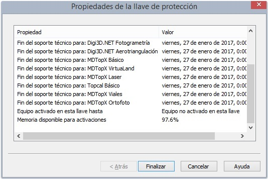

# Comprimir llave

Puedes comprimir la memoria almacenada en la llave de protección para almacenar más activaciones.

Las llaves de protección tienen memoria suficiente para almacenar unas 20 activaciones aproximadamente, por lo que podrás conectarla a distintos equipos y activarlos.

Si necesitas activar más de 20 ordenadores, la llave se quedará sin memoria y no quedará más remedio que eliminar las activaciones y comenzar de cero.

Con una llave mono puesto puede que nunca te encuentres con ese problema, pero si dispones de una llave de protección de red, con 250 licencias, por ejemplo, puedes encontrarte con este problema.

Para solucionar el problema debes ejecutar el programa [Elimina activaciones y alquileres](./) y marcar la casilla **Comprimir la memoria de la llave de protección** en la página de contraseña.

**Advertencia:**

Si activas un ordenador en una llave de protección con la memoria comprimida, no se almacenará la licencia del ordenador completa, sino que se almacenará un _hash_ de la licencia, es decir, un número. Si se produce algún cambio de hardware, como por ejemplo conectar un pendrive en un puerto USB distinto, o una actualización importante del sistema operativo, es posible que este _hash_ cambie, de manera que tendrás que volver a activar el ordenador.

Tienes que tener en cuenta, que los programas publicados con fecha anterior a 22 de junio de 2015 **no son compatibles con llaves comprimidas**, por lo que debes asegurarte de tener todos los programas actualizados antes de comprimir la llave de protección.

En el momento en el que se comprime la llave de protección, cada vez que activas una llave con el programa [Activar Ordenador](../activar-ordenador.md), éste almacena las licencias de forma comprimida.

Para eliminar la compresión de una llave de protección tienes que volver a ejecutar el programa [Eliminar Activaciones y Alquileres,](./) pero y no marcar la casilla **Comprimir la memoria de la llave de protección.**

Además, hemos hecho que el programa [Comprobar Licencias](../comprobar-licencias.md) muestre el porcentaje de memoria libre en la llave de protección:

También hemos introducido el concepto de **Contraseña de administración** en la llave de protección.  
Si entras en tu panel de administración de llaves de protección en [Mis llaves](https://www.digi21.net/MisLlaves) podrás comprobar que ha aparecido una nueva opción de configuración que te permite indicar una contraseña de administración. Los programas **Comprimir Llave** y **Eliminar Activaciones y Alquieres** solicitarán esta contraseña de activación.

