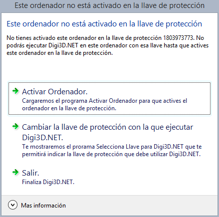

# Ordenador no activado

Este mensaje tiene tres posibles causas:

1. Que no has activado el programa en el que estás ejecutando el programa que te lo ha mostrado en la llave de protección mostrada.
2. Que haya expirado la fecha máxima de activación del ordenador en esa llave en particular.
3. Que dispongas de varias llaves de protección y que no hayas forzado a que el programa se comunique con una en particular y el programa se ha conectado con otra.

Puedes solucionar el problema ejecutando el programa [Activar ordenador](ActivarOrdenador.html).

A continuación, te mostramos cómo comunica Digi3D.NET este problema:

