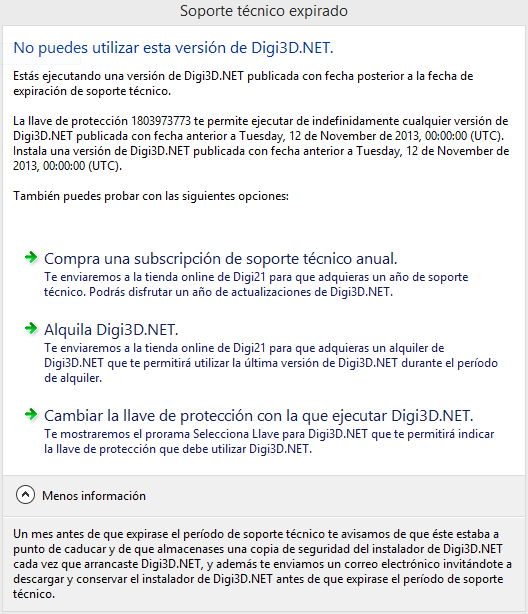

# Soporte técnico finalizado

Estás intentando ejecutar una versión de cualquiera de nuestros programas publicada con fecha posterior a la fecha máxima de soporte técnico que habías contratado.

Existen dos soluciones a este problema:

1. Adquiere un año de soporte técnico y actualizaciones en nuestra [Tienda Online](http://www.digi21.net/Tienda/Compra).
2. Desinstala la versión que del programa que estás intentando ejecutar e instala una versión publicada con fecha anterior a la fecha de expiración de soporte técnico que tienes contratada.

A continuación, te mostramos cómo comunica Digi3D.NET esta eventualidad:

