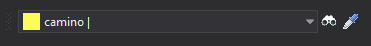

# Código

Permite ejecutar órdenes relacionadas con los códigos.

## Botones

* Desplegable que permite seleccionar el código activo.
* Botón que ejecuta la orden [COD](../ventana-de-dibujo/ordenes/c/cod.md).
* Botón que ejecuta la orden [CLONAR](../ventana-de-dibujo/ordenes/c/clonar.md).

