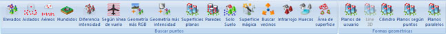

# Ficha de herramientas Clasificar LiDAR

[Cinta de herramientas](../cinta-de-herramientas/)

En esta ficha de herramientas aparecen los comandos relacionados con la clasificación de puntos LiDAR medidos con dispositivos láser aerotransportados del [módulo láser](../modulo-laser/).

* \*\*\*\*[**Elevados**](../modulo-laser/buscar-puntos/buscar-puntos-elevados.md): Herramienta destinada a la búsqueda y clasificación de puntos LiDAR en función de las propiedades geométricas que un punto tiene con su entorno
* \*\*\*\*[**Aislados**](../modulo-laser/buscar-puntos/buscar-puntos-aislados.md): Herramienta destinada a la búsqueda y clasificación de puntos LiDAR que se encuentren aislados, no encontrándose ningún punto cerca de su entorno, normalmente porque estos puntos tienen un valor de cota erróneo
* \*\*\*\*[**Aéreos**](../modulo-laser/buscar-puntos/buscar-puntos-aereos.md): Herramienta destinada a la búsqueda y clasificación de puntos LiDAR que tienen una cota mucho más elevado que los puntos de su entorno, normalmente porque el valor de esta cota es erróneo
* \*\*\*\*[**Hundidos**](../modulo-laser/buscar-puntos/buscar-puntos-hundidos.md): Herramienta destinada a la búsqueda y clasificación de puntos LiDAR que tienen una cota mucho más bajo que los puntos de su entorno, normalmente porque el valor de esta cota es erróneo
* \*\*\*\*[**Diferencia intensidad**](../modulo-laser/buscar-puntos/buscar-puntos-por-diferencia-de-intensidad.md): Herramienta destinada a la búsqueda y clasificación de puntos LiDAR en función de las diferencias entre los valores de intensidad que un punto tiene con su entorno
* \*\*\*\*[**Según línea de vuelo**](../modulo-laser/buscar-puntos/buscar-puntos-segun-linea-de-vuelo.md): Herramienta destinada a la búsqueda y clasificación de puntos LiDAR en función de las propiedades geométricas que un punto tiene con los puntos registrados antes o después en el vuelo
* \*\*\*\*[**Geometría más RGB**](../modulo-laser/buscar-puntos/buscar-puntos-segun-geometria-mas-rgb.md): Herramienta destinada a la búsqueda y clasificación de puntos LiDAR en función de las propiedades geométricas que un punto tiene con su entorno más el valor del color que tenga asignado
* \*\*\*\*[**Geometría más intensidad**](../modulo-laser/buscar-puntos/buscar-puntos-segun-geometria-mas-intensidad.md): Herramienta destinada a la búsqueda y clasificación de puntos LiDAR en función de las propiedades geométricas que un punto tiene con su entorno más el valor de la intensidad que tenga asignado
* \*\*\*\*[**Superficies planas**](../modulo-laser/buscar-puntos/buscar-puntos-en-superficies-planas.md): Herramienta destinada a la búsqueda y clasificación de puntos LiDAR que están situados en superficies planas con una inclinación máxima y una superficie mínima. Es decir, es muy indicada para la búsqueda de puntos que se han medido sobre las cubiertas de los edificios
* \*\*\*\*[**Paredes**](../modulo-laser/buscar-puntos/buscar-puntos-en-paredes.md): Herramienta destinada a la búsqueda y clasificación de puntos LiDAR que están situados en superficies verticales, como pueden ser las fachadas de los edificios
* \*\*\*\*[**Solo Suelo**](../modulo-laser/buscar-puntos/solo-suelo.md): Herramienta para la búsqueda rápida de puntos pertenecientes al suelo.
* \*\*\*\*[**Superficie mágica**](../modulo-laser/buscar-puntos/superficie-magica/): Herramienta destinada a la búsqueda y clasificación de puntos LiDAR de forma automática, combinando diversos algoritmos y herramientas de búsqueda.
* \*\*\*\*[**Buscar vecinos**](../modulo-laser/buscar-puntos/buscar-vecinos.md): Herramienta destinada a la búsqueda de puntos vecinos según clasificación.
* \*\*\*\*[**Infrarrojo**](../modulo-laser/buscar-puntos/buscar-puntos-segun-infrarrojo.md): Herramienta destinada a la búsqueda y clasificación de puntos LiDAR según el valor de infrarrojo almacenado.
* \*\*\*\*[**Huecos**](../modulo-laser/buscar-puntos/buscar-huecos.md): Herramienta destinada a la búsqueda y clasificación de puntos LiDAR que están situados en superficies verticales, como pueden ser las fachadas de los edificios
* \*\*\*\*[**Área de superficie**](../modulo-laser/buscar-puntos/buscar-puntos-segun-area.md): Herramienta destinada a la búsqueda y clasificación de puntos LiDAR según el área que forman con puntos vecinos con la misma clasificación.
* \*\*\*\*[**Planos de usuario**](../modulo-laser/formas-geometricas/buscar-puntos-sobre-planos.md): Herramienta destinada a la búsqueda y clasificación de puntos LiDAR que están situados en superficies definidas por el usuario.

