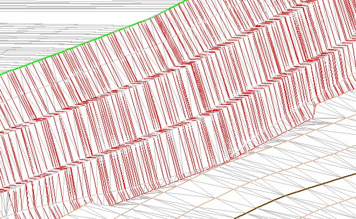

# Plataformas

[Plataformas](../como.../como-plataformas.md)

En este cuadro de diálogo aparecen los siguientes campos a rellenar:

* **Fichero con plataforma**: Fichero de dibujo que deberá contener las entidades que definen las posibles plataformas. Estas entidades deberán estar necesariamente cerradas, es decir, entidad es cuyo primer y último punto deberán coincidir. Obviamente, las entidades tendrán que estar ubicadas en la misma zona que el documento actual, es decir, debe haber zona común entre ambos. Además, deberán tener cota sus vértices, ya que dicha cota definirá la pendiente y altitud de las plataformas. A la derecha del campo se encuentra el botón \[...\], con el que el usuario podrá buscar el archivo utilizando el explorador de Windows.
* **Tipo de fichero**: La herramienta puede funcionar con dos tipos de datos:
  * Fichero con la línea límite de la plataforma a la cota que se ha diseñado.
  * Fichero con la línea intersección con el terreno para que el programa calcule dónde estaría la plataforma a una determinada cota que se deberá especificar.
* **Taludes**: Los taludes pueden ser de desmonte \(si la plataforma se encuentra por debajo del terreno natural\) o de terraplén \(si la plataforma se encuentra por encima del terreno natural\). Estos taludes se definen como un vector con sus dos componentes X e Y, donde el campo X representa el movimiento en planimetría y el Y el movimiento en altimetría. En ambos casos es posible indicar una berma cada cierto valor de la altura. En tal caso habrá que indicar cada cuánto se quiere incluir una berma y el ancho de ésta. A continuación, se representa un talud con berma.

* **Calcular cubicación**: Si se desea obtener la cubicación directamente entre el MDT con el terreno natural y el nuevo MDT con las plataformas proyectadas, se deberá activar esta opción. Si se activa se generará otro documento adicional con la cubicación calculada. Si no se activa, se podrá cubicar posteriormente con la herramienta [Cubicación](../como.../como-cubicacion.md).


Para poder utilizar esta herramienta es necesario tener activo un documento de tipo modelo digital de triangulación.


