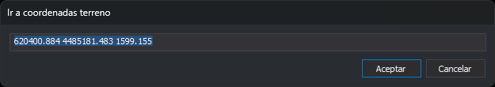

# Desplazando la ventana fotogramétrica a unas coordenadas conocidas
<!-- id: desplazando-ventana-foto-a-coordenadas -->

Existen varias formas de ordenar a la ventana fotogramétrica que se desplace a una determinada ubicación. Si conoces las coordenadas terreno de un punto, puedes escribirlas en el cuadro de diálogo **Ir a coordenadas terreno**.

El cuadro de diálogo tiene un único campo con las tres coordenadas separadas por espacios, en el orden X, Y y Z. Al abrirse, el campo muestra las coordenadas terreno en las que está la ventana fotogramétrica, con tres decimales.

1. Abre el menú **Ventana fotogramétrica** y selecciona la opción **Ir a coordenadas...**
2. Aparecerá el cuadro de diálogo **Ir a coordenadas terreno**.
3. Sustituye el texto del campo por `281854.98 4821292.06 75.36`.
4. Pulsa el botón **Aceptar**.
5. La ventana fotogramétrica se desplazará al extremo de un muro.

Vamos a desplazar la ventana 10 unidades en la coordenada **X**.

1. Abre el menú **Ventana fotogramétrica** y selecciona la opción **Ir a coordenadas...**
2. El campo muestra las coordenadas actuales: `281854.980 4821292.060 75.360`.
3. Cambia el primer valor por **281864.98**.
4. Pulsa el botón **Aceptar**.
5. La ventana se ha desplazado 10 metros en X desde el extremo del muro.

## Qué admite el campo

* Si escribes solo X e Y, la ventana conserva la Z actual.
* Si escribes más de tres valores, se usan los tres primeros.
* Si alguno de los dos primeros valores no es un número, o el tercero existe y no es un número, al pulsar **Aceptar** suena un aviso, el cuadro de diálogo sigue abierto y el texto queda seleccionado para corregirlo.

El cuadro de diálogo se puede ensanchar y guarda su tamaño y su posición para la próxima vez.

## Vídeo

<video controls><source src="https://digi21.blob.core.windows.net/videos-ayuda/Desplazando%20la%20ventana%20fotogrametrica%20a%20unas%20coordenadas%20conocidas.mp4" caption="" type="video/mp4"></video>
