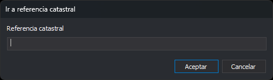

# Desplazando la ventana fotogramétrica a una referencia catastral
<!-- id: desplazando-ventana-foto-a-referencia-catastral -->

La ventana fotogramétrica se puede desplazar al centroide de una parcela del Catastro de España a partir de su referencia catastral. Digi3D.AI consulta las coordenadas del centroide al servicio web del Catastro, así que necesita conexión a Internet.

1. Abre el menú **Ventana fotogramétrica** y selecciona la opción **Ir a referencia catastral...**
2. Aparecerá el cuadro de diálogo **Ir a referencia catastral**.
3. Escribe la referencia catastral en el campo **Referencia catastral**.
4. Pulsa el botón **Aceptar**.
5. La ventana fotogramétrica se desplazará a las coordenadas X e Y del centroide de la parcela y conservará la Z actual.

## Detalles

* De la referencia solo se usan los 14 primeros caracteres, que identifican la parcela. Puedes escribir la referencia completa de 20 caracteres de un inmueble.
* El sistema de referencia de coordenadas del modelo no puede ser local. Si lo es, Digi3D.AI muestra un mensaje que indica que el sistema de coordenadas activo debe ser uno de los que admiten los servicios web del Catastro, y la ventana no se mueve.
* Si el sistema horizontal del modelo tiene código EPSG, Digi3D.AI pide al Catastro el centroide en ese sistema. Si el Catastro no admite ese código y responde en otro sistema, Digi3D.AI muestra el mismo mensaje y la ventana no se mueve.
* Si el sistema horizontal no tiene código EPSG, por ejemplo porque viene de un archivo .prj sin autoridad, el Catastro devuelve el centroide en ETRS89 UTM del huso de la parcela, y Digi3D.AI usa esas coordenadas sin transformarlas.
* Si el Catastro responde con un error, por ejemplo porque la referencia no existe, Digi3D.AI muestra el texto del error y la ventana no se mueve.
* La conexión usa la configuración de la sección [Comunicación con Internet](/digi3d-ai/referencia/cuadros-de-dialogo/configuracion/comunicacion-con-internet/README.md) del cuadro de diálogo **Configuración**: conexión directa, la de Windows o un servidor _PROXY_ con usuario y contraseña.
