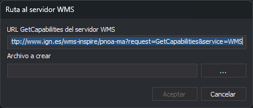
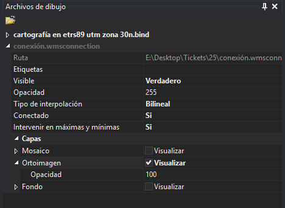
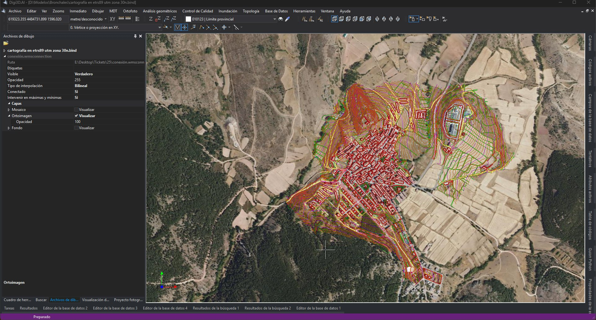

# Conectarse a un servidor WMS

Digi3D.AI puede mostrar en la ventana de dibujo las capas de un servidor WMS (*Web Map Service*), por ejemplo la ortofoto del PNOA, debajo de la cartografía. La conexión se guarda en un archivo `.wmsconnection` que se carga como archivo de referencia. Cada vez que cambias el zoom, Digi3D.AI pide al servidor la imagen de las capas activas para la zona visible.

El siguiente vídeo muestra el procedimiento completo:

<video controls><source src="https://digi21.blob.core.windows.net/videos-ayuda/CargarCapaWMS.mp4" type="video/mp4"></video>

## Requisitos

- La URL **GetCapabilities** del servidor WMS. Por ejemplo, la del PNOA del IGN:

  ```
  http://www.ign.es/wms-inspire/pnoa-ma?request=GetCapabilities&service=WMS
  ```

- Una ventana de dibujo con un sistema de referencia de coordenadas horizontal de la autoridad EPSG, en el que el servidor sirva al menos una capa. Consulta [Ubicación del SRC en los archivos de dibujo](/digi3d-ai/sistemas-referencia-coordenadas/implementacion-src-modulos-digi3d/archivos-de-dibujo/ubicacion-src-archivos-dibujo.md).

## 1. Crear el archivo de conexión

1. Abre la ventana de dibujo en la que quieres ver las capas. Si está abierta, Digi3D.AI cargará la conexión en ella automáticamente en el paso 5.
2. Selecciona **Archivo/Crear una conexión con un servidor WMS...**. Aparece el cuadro de diálogo **Ruta al servidor WMS**:

   

3. En **URL GetCapabilities del servidor WMS.**, escribe la URL del servidor. El cuadro de diálogo propone la del PNOA del IGN.
4. Pulsa **...** y elige la carpeta y el nombre del archivo `.wmsconnection` que se va a crear. El botón **Aceptar** permanece deshabilitado hasta que indicas el archivo.
5. Pulsa **Aceptar**. Digi3D.AI se conecta al servidor y lee sus capacidades:
   - Si la conexión falla, no se crea el archivo.
   - Si la conexión funciona, se crea el archivo. Si hay una ventana de dibujo abierta, Digi3D.AI lo carga en ella como archivo de referencia y muestra el panel **Archivos de dibujo**.

## 2. Cargar la conexión en la ventana de dibujo

Este paso solo es necesario si no había una ventana de dibujo abierta al crear la conexión, o si quieres usar la misma conexión en otra ventana de dibujo.

1. En la ventana de dibujo, ejecuta la orden [CARGA\_F](/digi3d-ai/referencia/ventana-de-dibujo/ordenes/c/carga-f.md) o selecciona **Archivo/Cargar archivo de referencia...**.
2. Elige el archivo `.wmsconnection`.

Si ninguna capa del servidor está disponible en el sistema de referencia de coordenadas de la ventana de dibujo, Digi3D.AI muestra el error **Sistemas de coordenadas de referencia incompatibles**, con el SRC de la ventana de dibujo y la lista de SRC que admite el servidor. Si el SRC de la ventana de dibujo no es de la autoridad EPSG, el error es **El sistema de coordenadas horizontal de la ventana de dibujo no es compatible con la autoridad EPSG.**

## 3. Elegir las capas y configurar la conexión

La conexión aparece en el panel **Archivos de dibujo** (**Ventana/Archivos de dibujo**). Despliégala para ver sus propiedades:



Al cargar la conexión, ninguna capa está activada. Despliega **Capas** y marca **Visualizar** en las capas que quieras ver.

| Propiedad | Descripción |
| :--- | :--- |
| Ruta | Ruta del archivo `.wmsconnection`. |
| Etiquetas | Etiquetas asignadas al archivo de dibujo. |
| Visible | Muestra u oculta todas las capas de la conexión. |
| Opacidad | Opacidad del archivo, de 0 (transparente) a 255 (opaco). |
| Tipo de interpolación | **Bilineal** o **Vecino mas próximo**. Bilineal muestra imágenes más nítidas al hacer zoom, pero requiere más cálculo. |
| Conectado | Si vale **Si**, Digi3D.AI envía una solicitud al servidor cada vez que cambias el zoom. |
| Intervenir en máximas y mínimas | Si vale **Si**, la extensión de las capas interviene en el cálculo de máximas y mínimas al hacer un zoom extendido. |
| Capas | Una entrada por cada capa del servidor, con su título. **Visualizar** activa o desactiva la capa, y **Opacidad** fija su opacidad, de 0 a 100 (por defecto, 100). Si la capa tiene subcapas, aparecen dentro de ella, en su propia categoría **Capas**. |

## 4. Resultado

Con **Visualizar** activado en una capa, la imagen del servidor aparece en la ventana de dibujo debajo de la cartografía:



Mientras **Conectado** valga **Si**, cada cambio de zoom vuelve a pedir al servidor la imagen de las capas activas para la zona visible.

## Véase también

- [WMS (Web Map Service)](/digi3d-ai/referencia/ventana-de-dibujo/importadores-y-exportadores/wms.md): características del formato `.wmsconnection`.
- [CARGA\_F](/digi3d-ai/referencia/ventana-de-dibujo/ordenes/c/carga-f.md): orden para cargar un archivo de referencia.
- [Importadores y exportadores](/digi3d-ai/referencia/ventana-de-dibujo/importadores-y-exportadores/README.md): formatos que Digi3D.AI puede leer y escribir.
