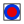

# Coincident

Espacio de nombres: [Digi21.DigiNG.Entities.Relations](/digi3d-net/programacion/.net/referencia/digi21.diging/digi21.diging.entities.relations/)  
Ensamblado: [Digi21.DigiNG](/digi3d-net/programacion/.net/referencia/digi21.diging.plugin/digi21.diging/)

Indica si los puntos son coincidentes.



```csharp
public static bool Coincident(ReadOnlyPoint a, ReadOnlyPoint b)
```

### Parámetros

`a` [ReadOnlyPoint](/digi3d-net/programacion/.net/referencia/digi21.diging/digi21.diging.entities/clases/readonlypoint/)  
Primer punto.

`b` [ReadOnlyPoint](/digi3d-net/programacion/.net/referencia/digi21.diging/digi21.diging.entities/clases/readonlypoint/)  
Segundo punto.

## Devuelve

[Boolean](https://docs.microsoft.com/en-us/dotnet/api/system.boolean?view=net-5.0)  
_Verdadero_ si los dos puntos son coincidentes.

