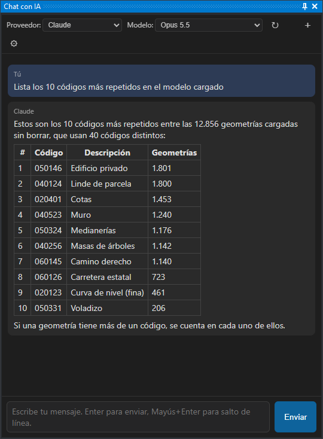

# Asistente con IA
<!-- id: asistente-ia -->

El **panel de chat con IA** permite pedir a un asistente de inteligencia artificial, **en lenguaje
natural**, que consulte y modifique el dibujo activo. Escribe lo que necesitas —por ejemplo *«haz un
zoom al primer edificio»*, *«¿cuántas curvas de nivel hay?»* o *«borra los textos con el código
050146»*— y el asistente lo realiza sobre la ventana de dibujo.

No hace falta saber programar: el asistente traduce la petición a operaciones sobre el dibujo.

El asistente funciona con varios **proveedores de IA**:

- **servicios en la nube**: Claude (Anthropic), OpenAI, Azure OpenAI, Kimi (Moonshot AI) y OpenRouter;
- **servidores locales**, que ejecutan el modelo en tu propio equipo o en un servidor de tu red, sin
  enviar datos a internet: LM Studio, Ollama o cualquier servidor compatible con la API de OpenAI.

## Abrir el panel

Selecciona **Ventana → Chat con IA**. El panel es acoplable, como los demás paneles de Digi3D.AI.

## Configurar el proveedor

La primera vez que abres el panel hay que elegir un proveedor y configurarlo:

1. Elige el proveedor en el desplegable **Proveedor** de la cabecera del panel.
2. Pulsa el botón **⚙** de la cabecera. Aparecen los campos **URL** y **API key**.
3. Escribe la **API key** (clave de acceso) que te ha dado el proveedor. Los servidores locales no
   necesitan clave.
4. Revisa la **URL**. Si el campo está vacío, Digi3D.AI usa la dirección habitual del proveedor, que
   aparece en gris dentro del campo. Azure OpenAI y OpenAI-compatible no tienen dirección habitual: en
   esos proveedores escribe la URL. Cámbiala también para un servidor local en otro equipo.
5. Pulsa **Guardar**.
6. Elige el modelo en el desplegable **Modelo**. Sin un modelo elegido, el asistente no envía la
   petición y muestra un aviso en la conversación.

Digi3D.AI guarda la configuración de cada proveedor por separado, así que puedes cambiar de proveedor
sin volver a escribir las claves. La URL y el modelo se guardan para cada usuario de _Windows_. La API
key se guarda cifrada con la protección de datos de _Windows_ (DPAPI) a nivel de equipo: la comparten
todos los usuarios del equipo y no sirve si se copia a otro equipo.

Al guardar una URL o una API key nuevas, el asistente olvida la conversación en curso, aunque los
mensajes siguen en pantalla.

Las instrucciones de cada proveedor están en estas páginas:

- [Proveedores en la nube](proveedores.md): dónde obtener la API key de cada servicio y qué poner en
  cada campo.
- [Configurar LM Studio](lm-studio.md): tutorial paso a paso para ejecutar el modelo en tu equipo con
  LM Studio.
- [Configurar Ollama](ollama.md): tutorial paso a paso para ejecutar el modelo en tu equipo, o en un
  servidor de tu red, con Ollama.

## Elegir el modelo

El desplegable **Modelo** muestra:

- los modelos recomendados del proveedor, si los tiene;
- los modelos que devuelve el servidor del proveedor. Digi3D.AI pide esta lista al arrancar, al
  cambiar a un proveedor cuya lista todavía no se ha pedido y al guardar una URL o una API key nuevas.
  No la pide si falta la URL o si falta la API key en un proveedor que la necesita. Azure OpenAI no
  ofrece esta lista. Para pedirla otra vez, pulsa **↻**;
- **Otro...**, para escribir a mano el identificador de un modelo que no aparece en la lista.

Digi3D.AI recuerda el modelo elegido para cada proveedor.

## Ejemplos de peticiones

Los ejemplos van de menos a más difíciles. Sirven también para comprobar que un proveedor o un modelo
nuevo funciona. Sustituye los códigos de ejemplo (`020400`, `050146`…) por códigos que existan en tu
dibujo.

**Consultas.** El asistente consulta el dibujo sin modificarlo.

- *«¿Cuántas geometrías hay cargadas?»*
- *«¿Cuántas geometrías hay de cada código? Dame los diez más frecuentes.»*
- *«¿Cuál es la cota máxima y la mínima de todo el dibujo?»*

**Búsquedas por concepto.** El asistente busca los códigos del concepto en la tabla de códigos y, si no
los encuentra, en los textos del dibujo.

- *«¿Cuántos edificios hay?»*
- *«¿Cuántas curvas de nivel maestras hay?»* El asistente distingue las curvas maestras de las
  normales por el código y por la cota respecto a la equidistancia.
- *«Llévame a la Plaza Mayor.»* Sustituye «Plaza Mayor» por un topónimo rotulado en tu dibujo. El
  asistente busca el texto y hace un zoom a él.

**Cálculos.** Comprueba el resultado con las órdenes de medida de Digi3D.AI.

- *«¿Cuál es el área total de los polígonos con código 020400?»*
- *«¿Qué punto con código X está más cerca del punto con código Y?»*

**Navegación.**

- *«Haz un zoom al primer edificio.»*

**Modificaciones.** El asistente indica cuántas geometrías ha cambiado. El cambio se deshace con UNDO.

- *«Cambia el código 020400 por 020401 en todas las geometrías que lo tengan.»*
- *«Borra todas las geometrías con código 020401.»* Aparece el cuadro **Confirmación de seguridad**
  (ver la sección *Operaciones que piden confirmación*).

**Conversación con contexto.** El asistente recuerda de qué se habla.

- *«¿Cuántas líneas hay con código 020400?»* y, a continuación, *«¿Y cuál es la más larga?»*

**Límites del entorno.** El asistente no tiene acceso al sistema operativo.

- *«¿Qué variables de entorno tiene el sistema?»* El asistente responde que no puede consultarlas.

**Programas reutilizables.** Si pides una orden, una orden interactiva o un control de calidad, el
asistente escribe el código en Python y te lo muestra para que lo instales tú.

- *«Escríbeme un control de calidad que compruebe que las curvas de nivel no tienen vértices
  repetidos.»*

El asistente conoce la **tabla de códigos del proyecto**. Por eso entiende conceptos como «edificio»,
«curva de nivel» o «parcela» sin que tengas que indicarle los códigos. Si un nombre no corresponde a
ningún código, el asistente busca también en los textos del dibujo (por ejemplo, un topónimo rotulado).

El asistente responde en el idioma en el que le escribes.

## Operaciones que piden confirmación

Antes de ejecutar una operación que no se puede deshacer, o de gran alcance, Digi3D.AI muestra el
cuadro **Confirmación de seguridad** con un resumen de lo que va a hacer el asistente. Piden
confirmación:

- borrar o sobrescribir archivos en disco;
- ejecutar comandos del sistema;
- borrar geometrías del dibujo;
- acceder a la red o a servicios web.

Pulsa **Permitir** para ejecutar la operación o **Cancelar** para impedirla. Si cancelas, la operación
no se ejecuta y el asistente recibe un aviso que le indica que no la repita. Si marcas **Permitir el resto de operaciones de esta
conversación**, Digi3D.AI no vuelve a preguntar hasta que empieces una conversación nueva.

## Detener al asistente

- Mientras el asistente espera la respuesta del proveedor, pulsa **Detener**.
- Mientras el asistente ejecuta una operación sobre el dibujo, Digi3D.AI no responde a la interfaz y
  el botón **Detener** no funciona: pulsa **Esc** con Digi3D.AI en primer plano. La operación se detiene
  en cuanto vuelve a ejecutar código Python, y el asistente te informa de que se ha cancelado. Si en
  ese momento está dentro de una función de Digi3D.AI que tarda, la operación se detiene cuando esa
  función termina.
- Una operación que tarda más de **5 minutos** se detiene sola. El límite se puede cambiar (ver
  [Ajustes avanzados](#ajustes-avanzados)).

## Deshacer

Los cambios que hace el asistente en el dibujo se deshacen con la orden **UNDO**, como cualquier otro
cambio. Cada operación del asistente es un paso de UNDO, y una petición puede generar varias
operaciones.

## Conversación e historial

- El asistente recuerda lo que se ha hablado en la conversación: puedes escribir *«¿y cuál es la más
  larga?»* después de preguntar por las líneas de un código.
- Para empezar una conversación nueva, pulsa **＋** en la cabecera. El asistente olvida la conversación
  anterior. Cambiar de proveedor también empieza una conversación nueva.
- Con el cursor en la primera línea del cuadro de texto, pulsa **flecha arriba** para recuperar los
  mensajes que has enviado antes, y **flecha abajo** para volver a los más recientes. Digi3D.AI guarda
  los últimos 100 mensajes entre sesiones.

## A tener en cuenta

- **La IA puede equivocarse.** Revisa el resultado, sobre todo después de operaciones importantes.
- **Privacidad.** Con un proveedor en la nube, el texto de la conversación y los datos del dibujo que
  consulta el asistente (códigos, coordenadas, textos) se envían a ese proveedor. Con LM Studio u Ollama,
  todos los datos se quedan en tu equipo o en tu red.
- **Coste.** Los proveedores en la nube cobran por uso a quien contrata la API key. Los servidores
  locales no tienen coste de uso, pero necesitan un equipo con una tarjeta gráfica adecuada.
- **Conexión.** Los proveedores en la nube necesitan conexión a internet. Si el proveedor está saturado
  o se supera el límite de uso de la cuenta, Digi3D.AI repite la petición hasta 3 veces antes de mostrar
  el error.
- **Entorno de Python limitado.** El asistente trabaja con un entorno de Python restringido: solo puede
  usar las bibliotecas de Digi3D.AI y una parte de la biblioteca estándar de Python, sin acceso a
  módulos del sistema operativo como `os` o `subprocess`. No se pueden instalar paquetes adicionales.

## Ajustes avanzados

Estos ajustes se cambian en el registro de Windows, en la clave
`HKEY_CURRENT_USER\Software\Digi21\Digi3D.NET\App\Configuration`. Son valores DWORD.
`ClaudeChatLimiteSegundos` se lee en cada operación del asistente. Los demás se leen al arrancar
Digi3D.AI, así que un cambio requiere reiniciar el programa.

| Valor | Por omisión | Efecto |
|---|---|---|
| `ClaudeChatLimiteSegundos` | 300 | Segundos que puede durar una operación del asistente antes de detenerse sola. 0 quita el límite. |
| `ClaudeChatConfirmaciones` | 1 | 0 desactiva el cuadro **Confirmación de seguridad**. No se recomienda. |
| `ClaudeChatTokens` | 0 | 1 muestra en la cabecera los *tokens* (unidades de texto por las que cobran los proveedores) consumidos en la conversación. |
| `ClaudeChatDebug` | 0 | 1 muestra en la conversación el código que ejecuta el asistente y su resultado, para diagnosticar problemas. |
| `CrearPanelChat` | 1 | 0 hace que Digi3D.AI no cree el panel de chat al arrancar. |

Un administrador puede sustituir las instrucciones que recibe el asistente creando el archivo de
texto `%PROGRAMDATA%\Digi3D.NET\ChatSystemPromptParteA.txt`. Si el archivo existe y no está vacío,
Digi3D.AI usa su contenido en lugar de las instrucciones incluidas en el programa. La referencia de la
API de Digi3D.AI que recibe el asistente se añade siempre.

## Requisitos

- El componente **WebView2** (Microsoft Edge), incluido de serie en Windows 10 y 11.
- Una **API key** de un proveedor en la nube, o un servidor local con LM Studio u Ollama.

## Véase también

- [Programación en Python](../../programacion/python/README.md): para automatizar tareas escribiendo
  tus propios guiones. El asistente usa esta misma API.
