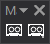
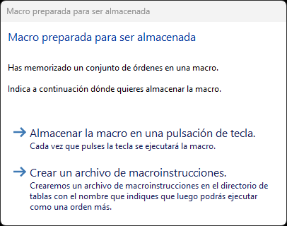
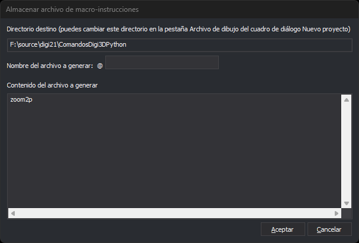

# Macro
<!-- id: macro -->

Graba una secuencia de órdenes para almacenarla en una pulsación de tecla o en un archivo de macroinstrucciones.

## Botones

* **Comenzar la grabación**: a partir de este momento, Digi3D.AI anota cada orden que ejecutas. La ventana de dibujo muestra un recuadro rojo mientras se graba la macro.
* **Finalizar la grabación**: termina la grabación y abre el cuadro de diálogo **Macro preparada para ser almacenada**. Si no se ha grabado ninguna orden, no hace nada más.

## Cuadro de diálogo Macro preparada para ser almacenada

Elige dónde se almacena la macro:

* **Almacenar la macro en una pulsación de tecla**: Digi3D.AI pide que pulses una tecla y abre el cuadro de diálogo de la orden [TECLA](../ventana-de-dibujo/ordenes/t/tecla.md) con la secuencia de órdenes grabada. Cada vez que pulses esa tecla se ejecutará la macro.
* **Crear un archivo de macroinstrucciones**: abre el cuadro de diálogo **Almacenar archivo de macro-instrucciones**. El archivo se podrá ejecutar después como una orden más.

## Cuadro de diálogo Almacenar archivo de macro-instrucciones

* **Directorio destino**: carpeta donde se crea el archivo. No se puede editar aquí: se cambia en la opción [Directorio de macroinstrucciones](../cuadros-de-dialogo/configuracion/diging/directorio-de-macroinstrucciones.md) de la sección **DigiNG** de **Herramientas/Configuración**. Si no hay ninguna carpeta indicada, Digi3D.AI avisa de que no se puede almacenar el archivo y no abre este cuadro de diálogo.
* **Nombre del archivo a generar**: nombre del archivo. Digi3D.AI le antepone `@`, el prefijo de los archivos de macroinstrucciones.
* **Contenido del archivo a generar**: las órdenes grabadas, una por línea. Puedes modificarlas antes de guardar.
* **Aceptar**: crea el archivo con el contenido del campo anterior. Si ya existe un archivo con ese nombre, lo sustituye.
* **Cancelar**: cierra el cuadro de diálogo sin crear el archivo.
