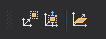

# Mover

Permite ejecutar órdenes relacionadas con mover de posición geometrías existentes.

## Botones

* Botón que ejecuta la orden [MOVER](/digi3d-ai/referencia/ventana-de-dibujo/ordenes/m/mover.md).
* Botón que ejecuta la orden [MOVER_Z](../ventana-de-dibujo/ordenes/m/mover-z.md).
* Botón que ejecuta la orden [CAMB_Z](../ventana-de-dibujo/ordenes/c/camb-z.md).
