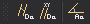

# Parámetros Activos

Permite ejecutar órdenes relacionadas con parámetros activos.

## Botones

* Botón que ejecuta la orden [DA1](/digi3d-ai/referencia/ventana-de-dibujo/variables/d/da1.md).
* Botón que ejecuta la orden [DA](/digi3d-ai/referencia/ventana-de-dibujo/variables/d/da.md).
* Botón que ejecuta la orden [AA](/digi3d-ai/referencia/ventana-de-dibujo/variables/a/aa.md).
