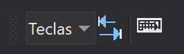

# Teclados

Esta barra de herramientas permite realizar acciones relacionadas con [archivos de configuración de teclas](/digi3d-ai/primeros-pasos/primeros-pasos-usuarios-versiones-anteriores/archivos-configuracion-teclas.md).

## Botones

* Desplegable que permite cambiar el teclado activo de entre todos los indicados para cargar con el cuadro de diálogo [Configuración de teclados virtuales](/digi3d-ai/referencia/cuadros-de-dialogo/configuracion-de-teclados-virtuales.md).
* Botón que ejecuta la orden [CAMBIA_TECLAS_MNU](../ventana-de-dibujo/ordenes/c/cambia-teclas-mnu.md).
* Botón que ejecuta la orden [TECLA](/digi3d-ai/referencia/ventana-de-dibujo/ordenes/t/tecla.md).
