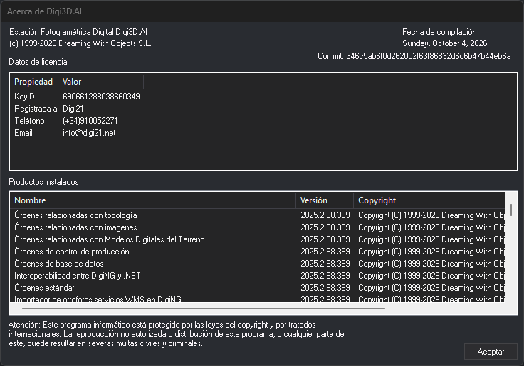

# Acerca de Digi3D.AI
<!-- id: acerca-de-digi3d-ai -->

Este cuadro de diálogo muestra la versión de Digi3D.AI, los datos de la licencia y las extensiones cargadas. Son los datos que pide el soporte técnico para identificar la instalación.

## Abrir el cuadro de diálogo

Selecciona la opción del menú **Ayuda/Acerca de Digi3D**.

## Campos

* **Fecha de compilación** y **Commit**: identifican la compilación exacta del programa. El commit es el identificador del código fuente con el que se compiló.
* **Datos de licencia**: las propiedades de la llave de protección:
  * **KeyID**: el número de la llave.
  * **Registrada a**, **Teléfono** y **Email**: los datos del cliente al que está registrada la llave.
* **Productos instalados**: el programa y cada una de las extensiones cargadas (órdenes, importadores y exportadores, sensores de la ventana fotogramétrica y dispositivos de entrada), con su nombre, su versión y su copyright.
* **Aceptar**: cierra el cuadro de diálogo.
