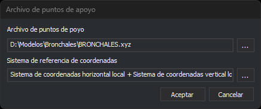

# Archivo de puntos de apoyo
<!-- id: archivo-de-puntos-de-apoyo -->

Este cuadro de diálogo indica el archivo con las coordenadas terreno de los puntos de apoyo y su sistema de referencia de coordenadas. Lo abren la orden [ORI\_ABSOLUTA](../ventana-fotogrametrica/ordenes/o/ori-absoluta.md), la medida de aerotriangulación ([AEROTRI](../ventana-fotogrametrica/ordenes/a/aerotri.md)) y la orientación genérica, que usan los sensores monoscópicos, ADS40, de ortofoto y satelitales:

* al empezar, si el modelo no tiene archivo de puntos de apoyo o no se puede leer;
* al pulsar el botón para cambiar el archivo de puntos de apoyo en el panel de la orientación.

## Campos

* **Archivo de puntos de apoyo**: ruta del archivo. Es de solo lectura: el botón **...** permite buscarlo entre los archivos `.xyz`, `.pnt`, `.ctl` y `.txt`.
* **Sistema de referencia de coordenadas**: el sistema en el que están las coordenadas del archivo. El botón **...** abre el cuadro de diálogo de selección del sistema de referencia.
* **Aceptar**: utiliza el archivo y el sistema indicados.
* **Cancelar**: cierra el cuadro de diálogo. Si se abrió al empezar la orientación, la orden termina.

## Al empezar la orientación

* Si el archivo indicado no se puede leer, Digi3D.AI muestra un error y vuelve a abrir el cuadro de diálogo. En la orientación absoluta y en la aerotriangulación, el error es «Advertencia: No se pudo cargar el archivo de puntos de apoyo: *archivo*». En la orientación genérica, es «No se pudo cargar el archivo de puntos de apoyo.».
* **Aceptar** con la ruta vacía termina la orden.

## Al cambiar el archivo desde el panel de la orientación

* Si el archivo nuevo no se puede leer, Digi3D.AI muestra un error y conserva el archivo anterior.
* En la orientación absoluta, si el archivo nuevo no tiene coordenadas para alguno de los puntos medidos, Digi3D.AI muestra la lista de esos puntos y pregunta «¿Aceptar nuevo archivo de puntos de apoyo?». **No** conserva el archivo anterior.
* En la orientación genérica, si el archivo nuevo no tiene alguno de los puntos medidos, Digi3D.AI muestra el error «No se localizó el punto: *nombre* en el archivo de puntos de apoyo cargado.» y conserva el archivo anterior.
