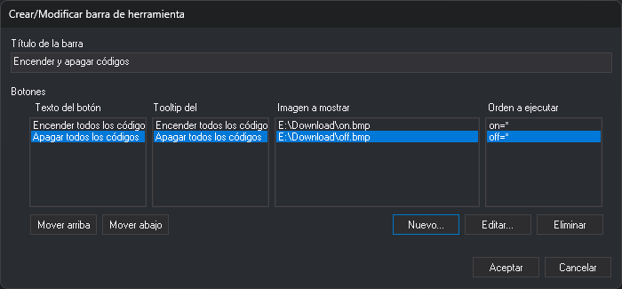
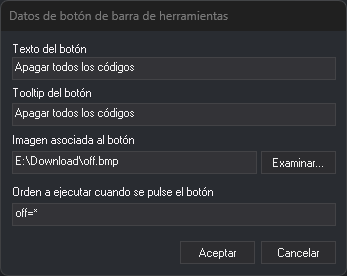

# Barras de herramientas de usuario
<!-- id: barras-de-herramientas-de-usuario -->

Las barras de herramientas de usuario son barras con botones que ejecutan órdenes de Digi3D.AI. Cada usuario de _Windows_ tiene las suyas.

## Manejador de barras de herramientas

Selecciona la opción del menú **Herramientas/Barras de herramientas de usuario...** para abrir este cuadro de diálogo. Muestra la lista de barras de herramientas de usuario y estos botones, que actúan sobre la barra seleccionada:

* **Nueva**: abre el cuadro de diálogo [Crear/Modificar barra de herramienta](#crearmodificar-barra-de-herramienta) para crear una barra.
* **Modificar**: abre el mismo cuadro de diálogo con los datos de la barra seleccionada.
* **Eliminar**: elimina la barra.
* **Mostrar** y **Ocultar**: muestran u ocultan la barra en la ventana principal.
* **Exportar**: solicita una carpeta y crea en ella la carpeta **BarraHerramientas** seguida del título de la barra. En esa carpeta guarda el archivo **BarraHerramientas.ini** con la definición de la barra y una copia de las imágenes de los botones.
* **Importar**: solicita una carpeta exportada con **Exportar** y añade la barra que contiene.

## Crear/Modificar barra de herramienta

* **Título de la barra**: el título que muestra la barra.
* **Botones**: los botones de la barra, en el orden en que aparecen. Cada fila de las cuatro listas corresponde a un botón, y al seleccionar un botón en cualquiera de las listas se selecciona en las cuatro:
  * **Texto del botón**: el texto que muestra el botón.
  * **Tooltip del botón**: el texto que aparece al situar el ratón sobre el botón.
  * **Imagen a mostrar**: el archivo de imagen del botón.
  * **Orden a ejecutar**: la orden que se ejecuta al pulsar el botón.
* **Mover arriba** y **Mover abajo**: cambian la posición del botón seleccionado.
* **Nuevo...**: abre el cuadro de diálogo [Datos de botón de barra de herramientas](#datos-de-botón-de-barra-de-herramientas) y añade el botón al final de la lista.
* **Editar...**: abre el mismo cuadro de diálogo con los datos del botón seleccionado.
* **Eliminar**: elimina el botón seleccionado.
* **Aceptar**: guarda la barra. **Cancelar** descarta los cambios.

## Datos de botón de barra de herramientas

* **Texto del botón**: el texto que muestra el botón.
* **Tooltip del botón**: el texto que aparece al situar el ratón sobre el botón.
* **Imagen asociada al botón**: el archivo de imagen del botón. **Examinar...** permite seleccionar un archivo de mapa de bits (`.bmp`).
* **Orden a ejecutar cuando se pulse el botón**: la orden, con sus parámetros, tal como se escribiría en la línea de órdenes.
