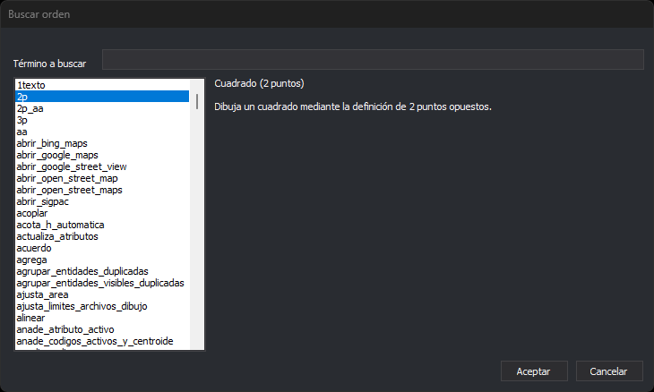

# Buscar orden
<!-- id: buscar-orden -->

Este cuadro de diálogo busca una orden por su nombre o su descripción. Lo abren la opción del menú **Inmediato/Ejecutar una orden por su nombre**, que ejecuta la orden elegida, y el botón **Buscar...** del cuadro de diálogo **Orden asignada a botón** de [Programar botones](programar-botones.md), que la asigna al botón.

## Campos

* **Término a buscar**: texto que se busca, sin distinguir mayúsculas de minúsculas. La lista muestra las órdenes cuyo nombre o cuya descripción lo contienen. En las órdenes de la ventana fotogramétrica solo se busca en el nombre.
* **Lista de órdenes**: las órdenes de la ventana de dibujo y, si hay una ventana fotogramétrica abierta, también las suyas.
* **Descripción**: el título y la descripción de la orden seleccionada.
* **Aceptar**: elige la orden seleccionada. Sin ninguna orden seleccionada equivale a **Cancelar**.
* **Cancelar**: cierra el cuadro de diálogo sin elegir ninguna orden.
