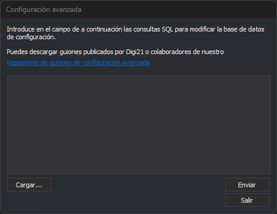

# Configuración avanzada
<!-- id: configuracion-avanzada -->



Este cuadro de diálogo ejecuta sentencias SQL sobre el [archivo de configuración Digi3DNET.db](../archivos/archivo-de-configuracion-digi3dnet.db.md), que guarda la configuración común a todos los usuarios del equipo. Sirve para aplicar de una vez un conjunto de cambios de configuración preparado en un guion, como los que publican Digi21 y otros usuarios en el [repositorio de guiones de configuración avanzada](https://github.com/digi21/ConfiguracionesAvanzadasDigi3D).

## Abrir el cuadro de diálogo

Selecciona la opción del menú **Herramientas/Configuración avanzada...**. La opción solo aparece en el menú que muestra Digi3D.AI cuando no hay ninguna ventana de dibujo ni fotogramétrica abierta.

## Uso del cuadro de diálogo

1. Escribe las sentencias SQL en el campo de texto, o pulsa **Cargar...** y selecciona un archivo `.sql`. El cuadro de diálogo **Abrir** se abre en la última carpeta desde la que cargaste un archivo. El archivo se lee en UTF-8 y su contenido sustituye al que haya en el campo.
2. Pulsa **Enviar** para ejecutar las sentencias.
3. Pulsa **Salir** para cerrar el cuadro de diálogo.

El enlace **Repositorio de guiones de configuración avanzada** abre ese repositorio en el navegador.

Al pulsar **Enviar**, Digi3D.AI procesa el campo de texto línea a línea:

* Cada línea se ejecuta por separado. Una sentencia no puede ocupar varias líneas. Una línea puede contener varias sentencias separadas por `;`.
* Las líneas que empiezan por `--` son comentarios y no se ejecutan.
* Las líneas vacías se omiten.
* Solo se procesan las 256 primeras líneas no vacías. Las líneas de comentario cuentan para ese límite. Las líneas siguientes no se ejecutan y Digi3D.AI no avisa.
* Si una sentencia falla, Digi3D.AI muestra el mensaje de error de SQLite y continúa con la línea siguiente. Las sentencias de la misma línea que van detrás de la que ha fallado no se ejecutan. Las sentencias de las líneas anteriores ya están aplicadas.
* Si no falla ninguna sentencia, Digi3D.AI no muestra ningún mensaje.

## Estructura de la base de datos

| Tabla | Contenido |
| :--- | :--- |
| `Keys` | Una fila por carpeta de configuración. `Id` es su identificador y `Path` su ruta, por ejemplo `App\Configuration` o `DigiNG\Configuration`. |
| `Ints` | Valores enteros. `Key` es el `Id` de la carpeta, `Value` el nombre del valor y `Data` el número. |
| `Doubles` | Valores reales, con las mismas columnas que `Ints`. |
| `Texts` | Valores de texto, con las mismas columnas que `Ints`. |
| `Blobs` | Valores binarios, con las mismas columnas que `Ints`. |

Ejemplo: esta línea asigna 1 al valor entero `FullMDI3D` de la carpeta `App\Configuration`:

```sql
UPDATE Ints SET Data = 1 WHERE Value = 'FullMDI3D' AND Key = (SELECT Id FROM Keys WHERE Path = 'App\Configuration');
```

Un valor que Digi3D.AI no ha leído nunca no tiene fila en su tabla. En ese caso `UPDATE` no modifica nada y hay que añadir la fila con `INSERT`.

## Observaciones

* Los cambios afectan a todos los usuarios del equipo. La configuración propia de cada usuario se guarda en el registro de _Windows_, en **HKEY\_CURRENT\_USER**. Las sentencias SQL no la modifican. El cuadro de diálogo solo guarda ahí la última carpeta usada con **Cargar...**.
* El cuadro de diálogo no deshace los cambios. Antes de ejecutar un guion, haz una copia del archivo **C:\ProgramData\Digi3D.NET\Digi3DNET.db**.
* Si un cambio no tiene efecto, cierra Digi3D.AI y vuelve a abrirlo.
