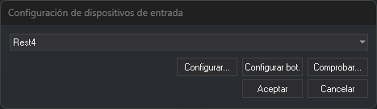
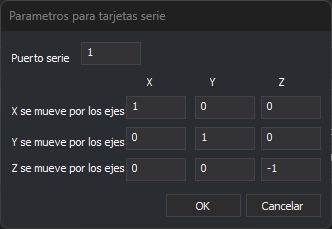
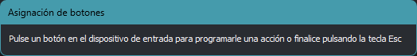
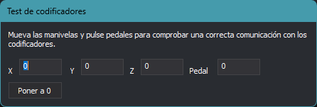

# Configuración de dispositivos de entrada
<!-- id: configuracion-de-dispositivos-de-entrada -->

Este cuadro de diálogo selecciona el dispositivo de entrada con el que se digitaliza en la ventana fotogramétrica (manivelas, pedales, ratones 3D…), lo configura y comprueba que se comunica con Digi3D.AI.

No es la sección [Dispositivos de entrada](configuracion/dispositivos-de-entrada/README.md) del cuadro de diálogo **Configuración**.

## Abrir el cuadro de diálogo

Selecciona la opción del menú **Herramientas/Configuración de dispositivos de entrada...**. La opción solo aparece en el menú que muestra Digi3D.AI cuando no hay ninguna ventana de dibujo ni fotogramétrica abierta.

## Campos

* **Desplegable**: los dispositivos de entrada que admiten las extensiones instaladas. **Ninguno** indica que no se usa ningún dispositivo de entrada.
* **Configurar...**: abre el cuadro de diálogo de configuración propio del dispositivo seleccionado. Está desactivado si el dispositivo no tiene parámetros que configurar.
* **Configurar bot.**: abre el cuadro de diálogo **Asignación de botones**.
* **Comprobar...**: abre el cuadro de diálogo **Test de codificadores**.
* **Aceptar**: guarda el dispositivo seleccionado y cierra el cuadro de diálogo.
* **Cancelar**: cierra el cuadro de diálogo sin cambiar el dispositivo.

Los botones **Configurar...**, **Configurar bot.** y **Comprobar...** están desactivados con **Ninguno** seleccionado.

## Configurar: parámetros del dispositivo

Cada dispositivo tiene su propio cuadro de diálogo de configuración. Los dispositivos que se conectan por puerto serie, como el Rest4, muestran **Parámetros para tarjetas serie**:

* **Puerto serie**: número del puerto COM al que está conectado el dispositivo.
* **X se mueve por los ejes**, **Y se mueve por los ejes** y **Z se mueve por los ejes**: cuánto cambia cada coordenada del cursor (filas) al mover cada eje del dispositivo (columnas **X**, **Y** y **Z**). Un valor negativo invierte el sentido. Por ejemplo, un `-1` en la fila de la Z y la columna Z hace que la manivela de la Z mueva el cursor en sentido contrario.

Estos parámetros se guardan para el equipo y para cada dispositivo por separado.

## Configurar bot.: Asignación de botones

1. Pulsa un botón o un pedal del dispositivo. Se abre el cuadro de diálogo **Orden asignada a botón**, descrito en [Programar botones](programar-botones.md).
2. Elige la acción o la orden que ejecuta ese botón y pulsa **Aceptar**.
3. Repite los pasos anteriores con cada botón que quieras programar.
4. Pulsa **Esc** para terminar.

## Comprobar: Test de codificadores

Muestra los valores de **X**, **Y**, **Z** y **Pedal** que envía el dispositivo. Mueve las manivelas y pulsa los pedales para comprobar que los valores cambian. El botón **Poner a 0** pone los contadores a cero.

## Observaciones

* El dispositivo seleccionado se guarda para el usuario de _Windows_, no para el equipo.
* Para configurar los ratones, joysticks y mandos que _Windows_ detecta como dispositivos HID, utiliza el cuadro de diálogo [Configuración de ratones, joysticks, mandos,...](configuracion-de-ratones-joysticks-y-mandos.md).
