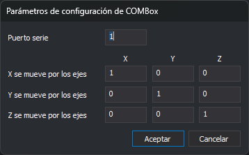
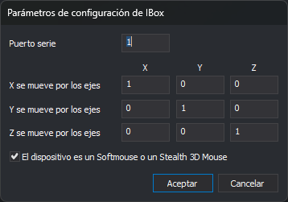
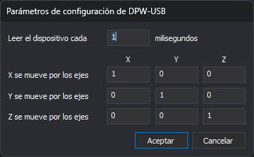
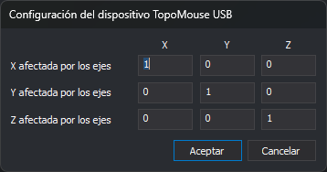

# Configuración de dispositivos de entrada
<!-- id: configuracion-de-dispositivos-de-entrada -->

Este cuadro de diálogo selecciona el dispositivo de entrada con el que se digitaliza en la ventana fotogramétrica (manivelas, pedales, ratones 3D…), lo configura y comprueba que se comunica con Digi3D.AI.

No es la sección [Dispositivos de entrada](configuracion/dispositivos-de-entrada/README.md) del cuadro de diálogo **Configuración**.

## Abrir el cuadro de diálogo

Selecciona la opción del menú **Herramientas/Configuración de dispositivos de entrada...**. La opción solo aparece en el menú que muestra Digi3D.AI cuando no hay ninguna ventana de dibujo ni fotogramétrica abierta.

El cuadro de diálogo también se abre al abrir una ventana fotogramétrica si Digi3D.AI no consigue comunicarse con el dispositivo de entrada seleccionado. En ese caso aparece el aviso **Error al conectar con el dispositivo de entrada**, con tres opciones:

* **Volver a probar a comunicar con el dispositivo**: intenta otra vez la comunicación.
* **Configurar el dispositivo de entrada.**: abre este cuadro de diálogo. Al cerrarlo, Digi3D.AI intenta comunicarse con el dispositivo seleccionado.
* **Continuar.**: abre la ventana fotogramétrica sin dispositivo de entrada.

## Campos

* **Desplegable**: los dispositivos de entrada que admiten las extensiones instaladas. **Ninguno** indica que no se usa ningún dispositivo de entrada.
* **Configurar...**: abre el cuadro de diálogo de configuración propio del dispositivo seleccionado. Está desactivado si el dispositivo no tiene parámetros que configurar.
* **Configurar bot.**: abre el cuadro de diálogo **Asignación de botones**.
* **Comprobar...**: abre el cuadro de diálogo **Test de codificadores**.
* **Aceptar**: guarda el dispositivo seleccionado y cierra el cuadro de diálogo.
* **Cancelar**: cierra el cuadro de diálogo sin cambiar el dispositivo.

Los botones **Configurar...**, **Configurar bot.** y **Comprobar...** están desactivados con **Ninguno** seleccionado.

**Configurar bot.** y **Comprobar...** se comunican con el dispositivo antes de abrir su cuadro de diálogo. Si la comunicación falla, Digi3D.AI muestra el aviso **Error al conectar con el dispositivo de entrada** con la descripción del error, y el cuadro de diálogo no se abre.

## Configurar: parámetros del dispositivo

Cada dispositivo tiene su propio cuadro de diálogo de configuración. Los dispositivos que se conectan por puerto serie (Rest4, FCodic, TopoMouse Serie y SEC-232m) muestran **Parámetros para tarjetas serie**:

* **Puerto serie**: número del puerto COM al que está conectado el dispositivo.
* **X se mueve por los ejes**, **Y se mueve por los ejes** y **Z se mueve por los ejes**: cuánto cambia cada coordenada del cursor (filas) al mover cada eje del dispositivo (columnas **X**, **Y** y **Z**). Un valor negativo invierte el sentido. Por ejemplo, un `-1` en la fila de la Z y la columna Z hace que la manivela de la Z mueva el cursor en sentido contrario.

Los cuadros de diálogo de los demás dispositivos tienen la misma tabla de ejes y, en la primera fila, el parámetro propio de cada dispositivo:

| Dispositivo | Cuadro de diálogo | Primera fila |
| --- | --- | --- |
| COMBox | **Parámetros de configuración de COMBox** | **Puerto serie** |
| IBox | **Parámetros de configuración de IBox** | **Puerto serie**. Añade la casilla **El dispositivo es un Softmouse o un Stealth 3D Mouse**, que gira 45° los ejes X e Y del dispositivo. |
| DPW | **Parámetros para tarjetas PCI** | **Leer la tarjeta cada** _n_ **milisegundos**: tiempo entre dos lecturas de la tarjeta. |
| DPW-USB | **Parámetros de configuración de DPW-USB** | **Leer el dispositivo cada** _n_ **milisegundos**: tiempo entre dos lecturas del dispositivo. |
| UDP/IP | **Parámetros para UDP/IP** | **Puerto**: puerto UDP en el que Digi3D.AI recibe las coordenadas. |
| Stealth 3D Mouse S1Z/S2Z/S3Z | **Configuración del dispositivo Stealth 3D Mouse** | Ninguna: solo la tabla de ejes. |
| TopoMouse USB | **Configuración del dispositivo TopoMouse USB** | Ninguna: solo la tabla de ejes. |

Si nunca se ha guardado la configuración de un dispositivo, el cuadro de diálogo muestra los valores que usa el dispositivo por defecto. **Aceptar** guarda los valores y **Cancelar** cierra el cuadro de diálogo sin guardarlos.

Cada dispositivo guarda su configuración por separado. La de Stealth 3D Mouse y TopoMouse USB se guarda para el usuario de _Windows_; la de los demás dispositivos, para el equipo.

## Configurar bot.: Asignación de botones

1. Pulsa un botón o un pedal del dispositivo. Se abre el cuadro de diálogo **Orden asignada a botón**, descrito en [Programar botones](programar-botones.md).
2. Elige la acción o la orden que ejecuta ese botón y pulsa **Aceptar**.
3. Repite los pasos anteriores con cada botón que quieras programar.
4. Pulsa **Esc** para terminar.

Cada asignación se guarda al pulsar **Aceptar** en el cuadro de diálogo **Orden asignada a botón**. Pulsar **Cancelar** en el cuadro de diálogo **Configuración de dispositivos de entrada** no deshace las asignaciones.

## Comprobar: Test de codificadores

Muestra los valores de **X**, **Y**, **Z** y **Pedal** que envía el dispositivo. Mueve las manivelas y pulsa los pedales para comprobar que los valores cambian. El botón **Poner a 0** pone los contadores a cero. El cuadro de diálogo no tiene botón de cierre: se cierra con **Esc**.

## Observaciones

* El dispositivo seleccionado se guarda para el usuario de _Windows_, no para el equipo.
* Para configurar los ratones, joysticks y mandos que _Windows_ detecta como dispositivos HID, utiliza el cuadro de diálogo [Configuración de ratones, joysticks, mandos,...](configuracion-de-ratones-joysticks-y-mandos.md).
