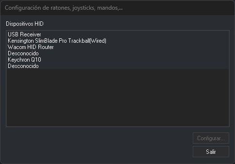
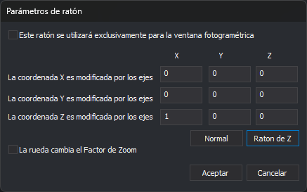
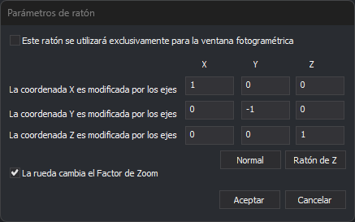

# Configuración de ratones, joysticks, mandos,...
<!-- id: configuracion-de-ratones-joysticks-y-mandos -->

Este cuadro de diálogo configura cómo mueven el cursor de la ventana fotogramétrica los ratones, joysticks y mandos que _Windows_ detecta como dispositivos HID.

## Abrir el cuadro de diálogo

Selecciona la opción del menú **Herramientas/Configuración de ratones, joysticks, mandos,...**. La opción solo aparece en el menú que muestra Digi3D.AI cuando no hay ninguna ventana de dibujo ni fotogramétrica abierta.

## Campos

* **Dispositivos HID detectados**: los ratones, joysticks y mandos conectados al equipo, con el nombre de producto que informa cada dispositivo. Si el dispositivo no informa de su nombre, aparece como **Desconocido**. La lista se rellena al iniciar Digi3D.AI: un dispositivo que se conecta después no aparece hasta que se reinicia el programa. Un joystick que Digi3D.AI no puede abrir no aparece en la lista.
* **Configurar...**: abre los parámetros del dispositivo seleccionado. Está deshabilitado mientras no hay ningún dispositivo seleccionado. Abre **Parámetros de ratón** para un ratón y **Parámetros del dispositivo** para cualquier otro dispositivo.
* **Salir**: cierra el cuadro de diálogo.

## Parámetros de ratón y Parámetros del dispositivo

La tabla de coeficientes indica cuánto cambia cada coordenada del cursor (filas X, Y y Z) al mover cada eje del dispositivo (columnas X, Y y Z). Por ejemplo, un 1 en la fila Y y la columna X hace que el movimiento del eje X del dispositivo cambie la coordenada Y del cursor. Un valor negativo invierte el sentido.

Si el dispositivo no tiene parámetros guardados, la tabla vale `1 0 0` en la fila X, `0 -1 0` en la fila Y y `0 0 1` en la fila Z: cada eje mueve su coordenada, y el eje Y en sentido contrario.

Ejemplo: un trackball dedicado a la Z. Con **Ratón de Z**, mover la bola de izquierda a derecha sube y baja la coordenada Z (fila Z, columna X = 1):

Ejemplo: un ratón para la X y la Y. Con **Normal**, el ratón mueve la X y la Y del cursor. En esta captura está marcada **La rueda cambia el Factor de Zoom**, así que la rueda cambia el zoom. Desmarcada, la rueda cambia la Z (fila Z, columna Z = 1):

**Parámetros de ratón** añade:

* **Normal**: el eje X del ratón mueve la X del cursor, el eje Y mueve la Y en sentido contrario y el eje Z (la rueda) mueve la Z.
* **Ratón de Z**: el movimiento horizontal del ratón cambia la Z del cursor, y ningún eje mueve la X ni la Y. Sirve para dedicar un segundo ratón a la Z.
* **La rueda cambia el Factor de Zoom**: girar la rueda hacia delante ejecuta la orden ZOOMIN de la ventana fotogramétrica, y hacia atrás, ZOOMOUT. Con esta opción marcada la rueda no actúa como eje Z.
* **Este ratón se utilizará exclusivamente para la ventana fotogramétrica**: Digi3D.AI guarda esta opción, pero no tiene ningún efecto: el ratón solo mueve el cursor de la ventana fotogramétrica mientras esta tiene el ratón capturado, esté marcada o no.

Pulsa **Aceptar** para guardar los parámetros o **Cancelar** para descartarlos.

## Observaciones

* Los parámetros se guardan para el usuario de _Windows_ y para el nombre de producto del dispositivo. Dos dispositivos con el mismo nombre comparten los parámetros.
* Para asignar órdenes a los botones de un ratón, utiliza el cuadro de diálogo [Programar botones](programar-botones.md).
