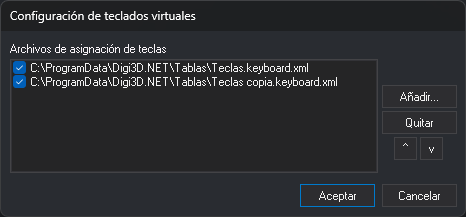

# Configuración de teclados virtuales
<!-- id: configuracion-de-teclados-virtuales -->

Este cuadro de diálogo indica qué archivos de asignación de teclas (`.keyboard.xml`) carga Digi3D.AI y en qué orden.

## Abrir el cuadro de diálogo

Selecciona la opción del menú **Herramientas/Configuración de teclados virtuales**. La opción solo aparece en el menú que muestra Digi3D.AI cuando no hay ninguna ventana de dibujo ni fotogramétrica abierta.

## Campos

* **Archivos de asignación de teclas**: los archivos configurados, en el orden en que se cargan. La casilla de la izquierda de cada archivo indica si se carga. Desmarca la casilla para dejar de cargar un archivo sin quitarlo de la lista.
* **Añadir...**: selecciona un archivo `.keyboard.xml` y lo añade al final de la lista, con la casilla marcada. Si el archivo ya está en la lista, no se añade.
* **Quitar**: quita de la lista el archivo seleccionado.
* **^** y **v**: suben o bajan una posición el archivo seleccionado.
* **Aceptar**: guarda la lista.
* **Cancelar**: cierra el cuadro de diálogo sin guardar los cambios.

## Observaciones

Al abrir una ventana de dibujo o una ventana fotogramétrica, Digi3D.AI carga todos los archivos de la lista que tienen la casilla marcada.

Si hay más de un archivo cargado, cambia de uno a otro con:

* La orden [CAMBIA_TECLAS_MNU](../ventana-de-dibujo/ordenes/c/cambia-teclas-mnu.md).
* El desplegable de la [Barra de herramientas Teclados](../barras-de-herramientas/teclados.md).
