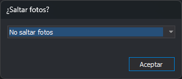

# Solicitar salto de fotos
<!-- id: solicitar-salto-de-fotos -->

Si se activa, al abrir un proyecto de Inpho (archivo `.prj`) Digi3D.AI muestra el cuadro de diálogo **¿Saltar fotos?**, que indica cómo se forman los modelos estereoscópicos de cada pasada.

## Valores posibles

* **Sí**. Se muestra el cuadro de diálogo **¿Saltar fotos?** cada vez que se abre un proyecto de Inpho.
* **No**. No se muestra el cuadro de diálogo, y cada modelo se forma con dos fotos consecutivas de la pasada. Es el valor por defecto.

## Cuadro de diálogo ¿Saltar fotos?

El desplegable indica cómo se forman los modelos de cada pasada. Las fotos de una pasada se recorren en el orden en que aparecen en el archivo de proyecto. En la tabla, *n* es el valor de **Fotos a saltar** y las fotos se numeran 1, 2, 3… dentro de la pasada:

| Opción | Modelos que se forman | Ejemplo con *n* = 1 |
|---|---|---|
| **No saltar fotos** | Cada foto con la siguiente. | 1-2, 2-3, 3-4… |
| **Saltar fotos** | Cada foto con la que está *n* + 1 posiciones después. El modelo siguiente empieza en la foto derecha del anterior, así que las fotos intermedias no forman parte de ningún modelo. | 1-3, 3-5, 5-7… |
| **Saltar fotos pero utilizarlas para otro modelo** | Cada foto con la que está *n* + 1 posiciones después, empezando un modelo en cada foto de la pasada. | 1-3, 2-4, 3-5… |

El nombre de cada modelo es el de su foto izquierda y el de su foto derecha separados por un guion.

### Fotos a saltar

Número de fotos que quedan entre la foto izquierda y la foto derecha de cada modelo. Este campo solo se muestra si se elige una opción distinta de **No saltar fotos**. Admite valores de 0 a 1000; con 0, las tres opciones forman los mismos modelos.

### Aceptar

Carga el proyecto con los modelos formados según la opción elegida. Si se pulsa la tecla **Esc**, el cuadro de diálogo se cierra y el proyecto se carga sin saltar fotos.

> **Ver también:** [Omitir modelos para los cuales no hay foto](omitir-modelos-para-los-cuales-no-hay-foto.md), que se aplica después de formar los modelos.
