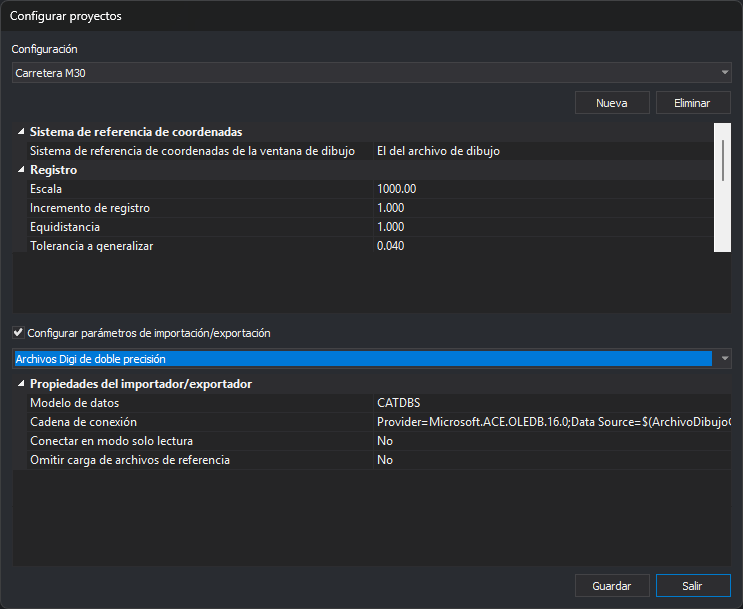

# Configurar proyectos
<!-- id: configurar-proyectos -->

Este cuadro de diálogo crea, modifica y elimina configuraciones de proyecto. Una configuración de proyecto agrupa los parámetros con los que se abre un archivo de dibujo: sistema de referencia de coordenadas, parámetros de registro, tabla de códigos, teclado y, opcionalmente, los parámetros de los importadores/exportadores.

Las configuraciones se usan en la pestaña [Archivo de dibujo](nuevo-proyecto/archivo-de-dibujo.md) del cuadro de diálogo Nuevo proyecto cuando está activada la opción [Utilizar archivos de proyecto](configuracion/comunicacion-con-el-usuario/utilizar-archivos-de-proyecto.md) del cuadro de diálogo [Configuración](configuracion/README.md). En ese caso, el usuario solo selecciona la configuración, y Nuevo proyecto aplica sus parámetros al archivo de dibujo.

## Abrir el cuadro de diálogo

Selecciona la opción del menú **Herramientas/Configurar proyectos**. La opción solo está habilitada si está activada la opción **Utilizar archivos de proyecto**.

## Campos

* **Configuración**: la configuración que se edita.
* **Nueva**: solicita el nombre de una configuración nueva y la añade a la lista. Si ya existe una configuración con ese nombre, muestra un aviso y no la añade. La configuración nueva no se guarda hasta pulsar **Guardar**.
* **Eliminar**: elimina la configuración seleccionada en el momento, sin pulsar **Guardar**.
* **Rejilla de propiedades** de la configuración:
  * **Sistema de referencia de coordenadas**: el sistema de referencia de coordenadas de la ventana de dibujo.
  * **Registro**: **Escala**, **Incremento de registro**, **Equidistancia**, **Tolerancia a generalizar**, **Corrección de Z** y **Sigma**. Son los mismos parámetros de la pestaña [Archivo de dibujo](nuevo-proyecto/archivo-de-dibujo.md).
  * **Entorno**: **Tabla de códigos** y **Teclado** (archivo de asignación de teclas). **Directorio de macroinstrucciones** y **Directorio de símbolos** se guardan, pero Nuevo proyecto no los aplica.
* **Configurar parámetros de importación/exportación**: si está marcada, la configuración incluye los parámetros de los importadores/exportadores. Selecciona un formato en la lista inferior para editar sus propiedades en la rejilla **Propiedades del importador/exportador**. Al abrir un archivo de dibujo con esta configuración, se usan estos parámetros y Nuevo proyecto no muestra la categoría del motor de importación/exportación.
* **Guardar**: guarda la configuración seleccionada.
* **Salir**: cierra el cuadro de diálogo. Los cambios que no se han guardado se pierden.

## Observaciones

* Las configuraciones son comunes a todos los usuarios del equipo: se guardan en el [archivo de configuración Digi3DNET.db](../archivos/archivo-de-configuracion-digi3dnet.db.md).
