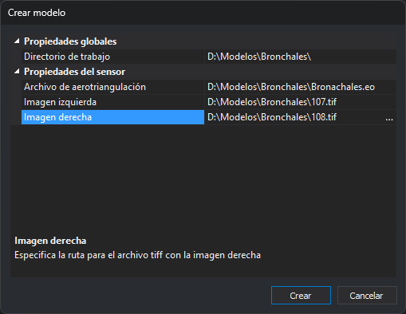

# Crear modelo
<!-- id: crear-modelo -->

Este cuadro de diálogo crea un archivo de modelo (`.d3d`) y lo añade a la pasada seleccionada. Lo abre el botón **Crear** de la lista **Modelos** del cuadro de diálogo [Crear proyecto fotogramétrico](crear-proyecto-fotogrametrico.md).

## Campos

* **Propiedades globales**
  * **Directorio de trabajo**: carpeta en la que se crea el archivo del modelo. Por defecto, la carpeta del archivo de proyecto.
* **Propiedades del sensor**: los parámetros del sensor seleccionado en el campo **Sensor** del cuadro de diálogo Crear proyecto fotogramétrico. Cada sensor muestra sus propios parámetros. Por ejemplo, el sensor Cónico solicita el archivo de aerotriangulación y las imágenes izquierda y derecha.
* **Área de descripción**: la parte inferior muestra la descripción del parámetro seleccionado.
* **Crear**: crea el archivo del modelo en el directorio de trabajo, con el nombre del modelo que proporciona el sensor y la extensión `.d3d` (con el sensor Cónico, por ejemplo, **107-108.d3d**). Después añade el modelo a la lista **Modelos** y cierra el cuadro de diálogo.
* **Cancelar**: cierra el cuadro de diálogo sin crear el modelo.
