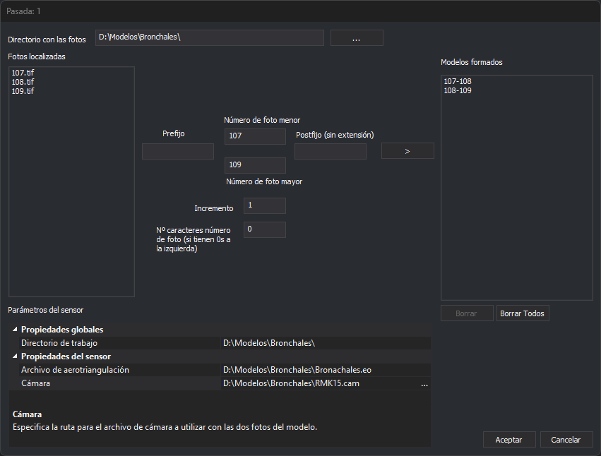

# Crear múltiples modelos
<!-- id: crear-multiples-modelos -->

Este cuadro de diálogo crea de una vez los archivos de modelo (`.d3d`) de una pasada a partir de los números de sus fotos, y los añade a la pasada seleccionada. Lo abre el botón **Crear varios** de la lista **Modelos** del cuadro de diálogo [Crear proyecto fotogramétrico](crear-proyecto-fotogrametrico.md). Ese botón solo está habilitado con el sensor Cónico. El título del cuadro de diálogo es el nombre de la pasada.

Cada modelo se forma con dos fotos cuyos números se diferencian en el valor de **Incremento**. Por ejemplo, con las fotos 107, 108 y 109 e incremento 1 se forman los modelos **107-108** y **108-109**.

## Campos

* **Directorio con las fotos**: carpeta en la que están las fotos. El botón **...** permite seleccionarla.
* **Fotos localizadas**: las imágenes de la carpeta, de cualquiera de los formatos ráster que admite Digi3D.AI.
* **Prefijo**: texto que precede al número en el nombre de las fotos.
* **Número de foto menor** y **Número de foto mayor**: intervalo de números de foto con los que se forman modelos.
* **Postfijo (sin extensión)**: texto que sigue al número en el nombre de las fotos, sin la extensión del archivo.
* **Incremento**: diferencia entre los números de las dos fotos de un modelo. Con un valor negativo, los modelos se forman desde la foto mayor hacia la menor. Con 0 no se forma ningún modelo.
* **Nº caracteres número de foto (si tienen 0s a la izquierda)**: número de cifras del número de foto, rellenando con ceros a la izquierda. Por ejemplo, con 4 la foto 25 se busca como **0025**. Con 0 el número se escribe sin ceros.
* **>**: forma los modelos y los añade a **Modelos formados**. Para cada número de foto del intervalo busca, sin distinguir mayúsculas de minúsculas, las fotos *prefijo + número + postfijo* de la foto izquierda y de la derecha. Solo añade el modelo si encuentra las dos fotos y el modelo no está ya en la lista. Está habilitado si hay al menos una foto en **Fotos localizadas** y el número de foto mayor es mayor que el menor.
* **Modelos formados**: los modelos que se van a crear, con el nombre *foto izquierda-foto derecha*.
* **Borrar** y **Borrar todos**: quitan de la lista el modelo seleccionado o todos los modelos.
* **Parámetros del sensor**: **Directorio de trabajo**, la carpeta en la que se crean los archivos de modelo, y los parámetros comunes a todos los modelos del sensor seleccionado (por ejemplo, con el sensor Cónico, el archivo de aerotriangulación y la cámara).
* **Aceptar**: crea un archivo *foto izquierda-foto derecha*.d3d por cada modelo de **Modelos formados** en el directorio de trabajo, los añade a la pasada y cierra el cuadro de diálogo. Si un archivo `.d3d` ya existe, lo sobrescribe sin avisar. Si no puede crear un archivo, muestra el error «Error al crear el archivo: *ruta*» y continúa con los demás. Al terminar muestra «Se han localizado errores al generar los siguientes archivos:» con la lista de los que han fallado, y no cierra el cuadro de diálogo. Los archivos que sí se han creado quedan en el disco.
* **Cancelar**: cierra el cuadro de diálogo sin crear ningún modelo.

## Observaciones

Digi3D.AI recuerda el prefijo, el postfijo, los números de foto, el incremento y el número de caracteres para la próxima vez que se abra el cuadro de diálogo.
