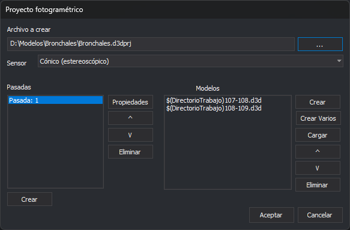
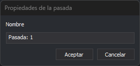

# Crear proyecto fotogramétrico
<!-- id: crear-proyecto-fotogrametrico -->

Este cuadro de diálogo crea o modifica un archivo de proyecto fotogramétrico (`.d3dprj`). El archivo enumera las pasadas del proyecto y los modelos (archivos `.d3d`) de cada pasada, y lo carga el panel [Proyecto fotogramétrico](../paneles/proyecto-fotogrametrico.md) para cambiar de modelo rápidamente.

## Abrir el cuadro de diálogo

Pulsa el botón de nuevo proyecto de la barra de herramientas del panel [Proyecto fotogramétrico](../paneles/proyecto-fotogrametrico.md).

## Campos

* **Archivo a crear**: la ruta del archivo de proyecto. El botón **...** permite seleccionarla. Si el archivo ya existe, el cuadro de diálogo carga sus pasadas y sus modelos para modificarlos.
* **Sensor**: el sensor de los modelos que se crean con **Crear** y **Crear Varios**.
* **Pasadas**: las pasadas del proyecto.
  * **Crear**: abre el cuadro de diálogo [Propiedades de la pasada](#propiedades-de-la-pasada) y añade una pasada.
  * **Propiedades**: cambia el nombre de la pasada seleccionada. También se abre con doble clic sobre la pasada.
  * **^** y **v**: suben o bajan la pasada seleccionada.
  * **Eliminar**: elimina la pasada seleccionada.
* **Modelos**: los modelos de la pasada seleccionada.
  * **Crear**: crea un modelo nuevo con el cuadro de diálogo [Crear modelo](crear-modelo.md).
  * **Crear Varios**: crea varios modelos a partir de los números de foto con el cuadro de diálogo [Crear múltiples modelos](crear-multiples-modelos.md). Solo está habilitado si el sensor lo permite.
  * **Cargar**: añade un archivo de modelo (`.d3d`) existente.
  * **^** y **v**: suben o bajan el modelo seleccionado.
  * **Eliminar**: quita el modelo seleccionado de la pasada. No borra el archivo del modelo.
* **Aceptar**: guarda el archivo de proyecto. Si no se ha indicado el archivo o no hay ninguna pasada, muestra un aviso.
* **Cancelar**: cierra el cuadro de diálogo sin guardar.

## Propiedades de la pasada

* **Nombre**: el nombre de la pasada. Al crear una pasada se propone **Pasada:** seguido del número de la pasada.

## Observaciones

Si la opción [Sustituir rutas por sustituidores](configuracion/rutas/sustituir-rutas-por-sustituidores.md) está activada, las rutas de los modelos se guardan con la variable `$(DirectorioTrabajo)` cuando están en la carpeta del archivo de proyecto.
