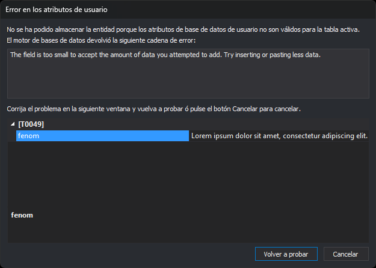

# Error en los atributos de usuario
<!-- id: error-en-los-atributos-de-usuario -->

Digi3D.AI muestra este cuadro de diálogo cuando no puede guardar en la base de datos los atributos de una entidad que se acaba de registrar. Ocurre en estos casos:

* El motor de base de datos rechaza el valor de un atributo. Por ejemplo, un texto más largo que el tamaño del campo en la base de datos.
* El esquema de la tabla en la tabla de códigos indica que un campo no admite longitud cero y el atributo está vacío.
* Un control de calidad que se ejecuta al dibujar rechaza el valor de un atributo.

## Campos

* **Cadena de error**: el mensaje que devolvió el motor de base de datos o el control de calidad.
* **Rejilla de atributos**: muestra solo el atributo que ha fallado. Corrige su valor aquí. La rejilla queda vacía si el campo pertenece a un grupo del esquema de la tabla o está marcado como oculto.
* **Volver a probar**: intenta guardar otra vez la entidad con los valores corregidos.
* **Cancelar**: Digi3D.AI pregunta qué hacer con la entidad:
  * Volver a asignar un valor al atributo: muestra otra vez este cuadro de diálogo.
  * Almacenar únicamente la geometría de la entidad, sin atributos de base de datos.
  * No almacenar la entidad.

  Si el error lo produjo un control de calidad, **Cancelar** descarta la entidad sin preguntar.
