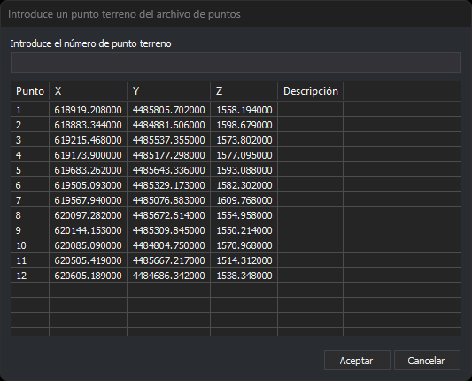

# Introduce un punto terreno del archivo de puntos
<!-- id: introduce-punto-terreno -->

Este cuadro de diálogo pide el punto de apoyo que vas a medir. Lo abren los paneles de [orientación absoluta](../ventana-fotogrametrica/ordenes/o/ori-absoluta.md), de [medida de aerotriangulación](../ventana-fotogrametrica/ordenes/a/aerotri.md) y [Orientación](../paneles/orientacion.md), que usan los sensores que la admiten. Muestra los puntos del [archivo de puntos de apoyo](archivo-de-puntos-de-apoyo.md).

## Campos

* **Introduce el número de punto terreno**: nombre del punto que vas a medir. Al hacer clic en un punto de la lista, su nombre se copia en este campo.
* **Lista de puntos**: los puntos del archivo, con su nombre (**Punto**), sus tres coordenadas y su **Descripción**. Los títulos de las columnas de coordenadas son los nombres de los ejes del sistema de referencia de coordenadas de los puntos de apoyo. Si no se pueden obtener, las columnas se titulan **X**, **Y** y **Z**.
* **Aceptar**: mide el punto indicado. Escribir `0` o dejar el campo vacío equivale a no elegir ningún punto.
* **Cancelar**: cierra el cuadro de diálogo sin elegir punto.

## Puntos que no se aceptan

* **Punto que no está en el archivo de puntos**:
  * En la orientación absoluta, Digi3D.AI muestra el error «ERROR: El punto *nombre* no existe en el archivo de puntos.» y vuelve a abrir el cuadro de diálogo.
  * En la orientación genérica, Digi3D.AI muestra el error «No se localizó el punto: *nombre* en el archivo de puntos de apoyo cargado.» y vuelve a abrir el cuadro de diálogo.
  * En la medida de aerotriangulación, el punto se acepta como punto de aerotriangulación.
* **Nombre que coincide con un centro de proyección** (el nombre de una de las fotos): Digi3D.AI muestra un error y vuelve a abrir el cuadro de diálogo.
