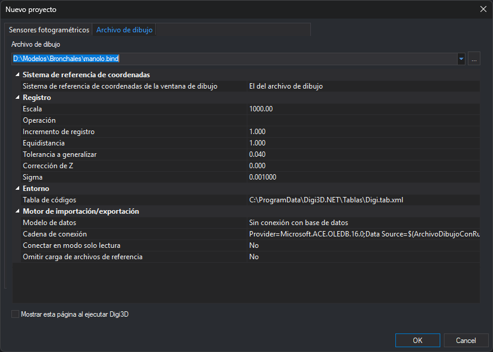

# Nuevo proyecto
<!-- id: nuevo-proyecto-2 -->

Este cuadro de diálogo abre un modelo fotogramétrico en una ventana fotogramétrica o un archivo de dibujo en una ventana de dibujo, según la pestaña activa al pulsar **Aceptar**:

* [Sensores fotogramétricos](sensores-fotogrametricos.md): abre o crea un modelo fotogramétrico.
* [Archivo de dibujo](archivo-de-dibujo.md): abre un archivo de dibujo.

Digi3D.AI lo muestra al arrancar sin argumentos y con la opción del menú **Archivo/Abrir**.
