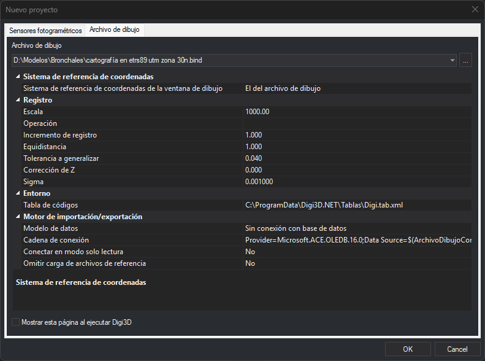

# Archivo de dibujo
<!-- id: archivo-de-dibujo -->

Esta pestaña del cuadro de diálogo [Nuevo proyecto](README.md) abre un archivo de dibujo en una ventana de dibujo y fija los parámetros con los que se trabaja en ella.

## Abrir la pestaña

Selecciona la opción del menú **Archivo/Abrir** y pulsa la pestaña **Archivo de dibujo**.

## Campos

* **Archivo de dibujo**: ruta del archivo que se abre. El desplegable ofrece los diez últimos archivos abiertos desde esta pestaña, y el botón **...** permite buscar uno.
* **Mostrar esta página al ejecutar Digi3D**: el cuadro de diálogo Nuevo proyecto se abre en esta pestaña en lugar de en [Sensores fotogramétricos](sensores-fotogrametricos.md).

Debajo del archivo hay una rejilla de propiedades agrupadas en categorías.

### Sistema de referencia de coordenadas

Esta categoría solo aparece si está activada la opción de mostrar el sistema de referencia al abrir un archivo de dibujo.

* **Sistema de referencia de coordenadas de la ventana de dibujo**: el sistema en el que trabaja la ventana. **El del archivo de dibujo** utiliza el que tenga el archivo. Si la categoría no aparece, la ventana trabaja en un sistema de referencia compuesto local.

### Registro

* **Escala**: escala de visualización de los patrones de las líneas. El desplegable ofrece escalas habituales, de 1:100 a 1:250.000, y se puede escribir cualquier otra.
* **Operación**: **Guardar** almacena los valores de incremento de registro, equidistancia y tolerancia a generalizar, junto con la altura de los textos, para la escala indicada. **Cargar** recupera los valores almacenados para esa escala.
* **Incremento de registro**: cada cuántos metros se registra un punto al digitalizar en modo continuo.
* **Equidistancia**: cada cuántos metros se registra una curva de nivel.
* **Altura de textos**: altura de los textos que se registran, la de la variable [AT](../../ventana-de-dibujo/variables/a/at.md).
* **Tolerancia a generalizar**: longitud mínima de un segmento al digitalizar en modo continuo.
* **Corrección de Z**: diferencia de Z entre operadores. Hay que ajustarla si quien hizo la orientación absoluta no es quien restituye el modelo.
* **Sigma**: valor por debajo del cual dos valores se consideran idénticos.

### Entorno

* **Tabla de códigos**: archivo con los códigos, su representación y su traducción, en formato `.dt` o `.tab.xml`. El desplegable ofrece las últimas tablas utilizadas.
* **Orden de inicio**: orden que se ejecuta cada vez que se abre un archivo de dibujo, también desde la línea de comandos. Se ejecuta después de las órdenes de inicio de la tabla de códigos y antes de la orden indicada en la línea de comandos. Para ejecutar un archivo de macroinstrucciones, escribe `@` seguido de su ruta.

### Motor de importación/exportación

Los parámetros del importador o exportador del formato del archivo de dibujo. Cambian según la extensión del archivo seleccionado: por ejemplo, el archivo `.bind` de la captura muestra el modelo de datos, la cadena de conexión con la base de datos, la conexión en modo de solo lectura y la omisión de los archivos de referencia.

Los formatos que se pueden abrir en una ventana de dibujo, y la página que explica sus parámetros (sección **Parámetros del motor de importación/exportación**):

| Formato | Extensión | Parámetros |
| :--- | :--- | :--- |
| Archivos Digi | `.bin`, `.bik` | [Archivos Digi](../../ventana-de-dibujo/importadores-y-exportadores/bin.md) |
| Archivos Digi de doble precisión | `.bind` | [Archivos Digi de doble precisión](../../ventana-de-dibujo/importadores-y-exportadores/bin-doble-precision.md) |
| MicroStation DGN v8 | `.dgn` | [DGN](../../ventana-de-dibujo/importadores-y-exportadores/dgn.md) |
| AutoCAD DWG | `.dwg` | [DWG](../../ventana-de-dibujo/importadores-y-exportadores/dwg.md) |
| Shapefile de ESRI | `.shp` | [Shapefile](../../ventana-de-dibujo/importadores-y-exportadores/shp.md) |
| Datawarehouse de Geomedia | `.mdb` | [Geomedia](../../ventana-de-dibujo/importadores-y-exportadores/geomedia.md) |
| KML de Google Earth | `.kml` | [KML](../../ventana-de-dibujo/importadores-y-exportadores/kml.md) |
| Conexión con PostGIS | `.pg` | [PostGIS](../../ventana-de-dibujo/importadores-y-exportadores/postgis.md) |
| Esri FileGDB | `.gdb` | No tiene parámetros: la categoría aparece vacía. |
| GeoPackage | `.gpkg` | No tiene parámetros: la categoría aparece vacía. |
| WKT | `.wkt` | No tiene parámetros: la categoría aparece vacía. |

## Observaciones

Al pulsar **Aceptar**, Digi3D.AI guarda los valores de la rejilla. La próxima vez que abras esta pestaña, son los valores iniciales. La primera vez, los valores son: escala 1000, incremento de registro 1, equidistancia 1, altura de textos 1,5, tolerancia a generalizar 0,04, corrección de Z 0 y sigma 0,001.

Si está activada la opción de utilizar proyectos de archivos de dibujo, la rejilla muestra la categoría **Configuración de archivo de dibujo**, con la configuración que se aplica al archivo. Las configuraciones se crean en [Configurar proyectos](../configurar-proyectos.md). Si la configuración elegida no configura los parámetros del motor de importación/exportación, la rejilla muestra también la categoría **Motor de importación/exportación**. Al pulsar **Aceptar**, los valores de registro, la tabla de códigos, la orden de inicio y el sistema de referencia de coordenadas se sustituyen por los de la configuración elegida. Si no hay ninguna configuración elegida, Digi3D.AI muestra el error «No ha seleccionado ninguna configuración de archivo de dibujo.».

## Errores al abrir el archivo

* Si ya hay una ventana de dibujo abierta, Digi3D.AI muestra el error «No se pueden abrir dos archivos de dibujo simultáneamente.» y no abre el archivo.
* Si la ruta del archivo no es válida, Digi3D.AI muestra el cuadro **Error al crear el archivo de dibujo** con el texto «No se ha podido crear el archivo de dibujo.».
