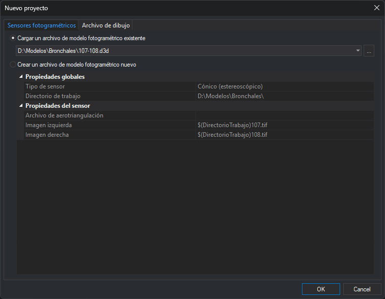

# Sensores fotogramétricos
<!-- id: sensores-fotogrametricos -->

Esta pestaña del cuadro de diálogo [Nuevo proyecto](README.md) abre un modelo fotogramétrico en una ventana fotogramétrica. El modelo se guarda en un archivo de modelo (`.d3d`), que indica el sensor y los archivos del modelo (imágenes, orientaciones, cámara…).

## Campos

* **Cargar un archivo de modelo fotogramétrico existente**: abre un archivo `.d3d` creado previamente.
  * **Lista de archivos**: los últimos diez archivos de modelo abiertos.
  * **...**: selecciona otro archivo `.d3d`.
  * **Rejilla de propiedades**: muestra, sin permitir modificarlas, las propiedades del archivo seleccionado: el tipo de sensor, el directorio de trabajo y los parámetros del sensor. Así se puede comprobar qué va a cargar el archivo antes de abrirlo. Si el archivo no se puede leer, la rejilla muestra el motivo. Con el sensor WMS solo se muestran el tipo de sensor y el directorio.
* **Crear un archivo de modelo fotogramétrico nuevo**: crea un archivo `.d3d` y lo abre.
  * **Directorio de trabajo**: carpeta en la que se crea el archivo del modelo.
  * **Tipo de sensor**: el sensor del modelo.
  * **Propiedades del sensor**: los parámetros del sensor elegido. Cada sensor pide los suyos; por ejemplo, el sensor Cónico pide el archivo de aerotriangulación y las imágenes izquierda y derecha.
* **OK**: abre el archivo seleccionado, o crea el archivo nuevo con el nombre del modelo que proporciona el sensor y lo abre.
* **Cancel**: cierra el cuadro de diálogo sin abrir nada.
