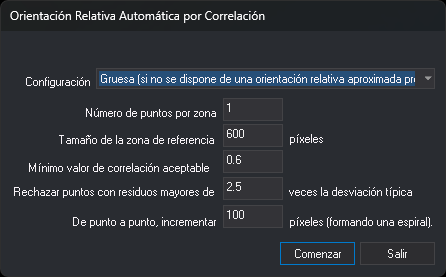

# Orientación relativa automática por correlación
<!-- id: orientacion-relativa-automatica-por-correlacion -->

Este cuadro de diálogo mide por correlación los puntos de la orientación relativa. Se abre en dos casos:

* Al pulsar **Correlar todo** en el panel **Orientación relativa** de la orden [ORI\_RELATIVA](/digi3d-ai/referencia/ventana-fotogrametrica/ordenes/o/ori_relativa.md). En este caso no aparece el campo **Esquema**: las zonas de correlación son las posiciones de los puntos del panel, del esquema o ya medidos.
* Al cargar un proyecto fotogramétrico con modelos que no tienen orientación relativa, si se acepta calcularlas. En este caso aparece el campo **Esquema**, **Comenzar** cierra el cuadro de diálogo sin guardar los valores y Digi3D.AI calcula con ellos la orientación relativa de todos esos modelos.

## Campos

* **Esquema**: esquema de Von Gruber cuyos puntos definen las zonas de correlación.
* **Configuración**: juego de valores para los campos siguientes. Digi3D.AI guarda los valores de cada configuración por separado y los carga al elegirla.
  * **Gruesa (sin orientación relativa aproximada)**: por omisión, 9 puntos por zona, zona de referencia de 600 píxeles, correlación mínima 0,6, factor 2,5 e incremento de 100 píxeles.
  * **Fina (con las zonas de correlación marcadas)**: por omisión, 6 puntos por zona, zona de referencia de 400 píxeles, correlación mínima 0,7, factor 2,5 e incremento de 100 píxeles.
* **Número de puntos por zona**: número máximo de puntos que se buscan en cada zona.
* **Tamaño de la zona de referencia**: lado, en píxeles de la imagen a resolución completa, de la ventana de la imagen izquierda que se busca en la derecha en el nivel piramidal 16.
* **Mínimo valor de correlación aceptable**: factor de correlación por debajo del cual se descarta un punto.
* **Rechazar puntos con residuos mayores de ... veces la desviación típica**: tras cada cálculo de la orientación relativa se excluye el punto con el residuo más grande que supere este número de veces la desviación típica. El cálculo se repite hasta que ningún punto lo supera.
* **De punto a punto, incrementar ... píxeles (formando una espiral)**: distancia en píxeles entre los puntos que se prueban alrededor del centro de cada zona. Los puntos se recorren en espiral desde el centro.

## Proceso

Al pulsar **Comenzar** desde el panel **Orientación relativa**, Digi3D.AI guarda los valores de la configuración elegida y, para cada zona:

1. Busca la zona en la imagen derecha en los niveles piramidales 16 y 8.
2. Recorre en espiral los puntos de alrededor y correla cada uno en los niveles 4 y 1. Acepta el punto si el factor de correlación supera el mínimo, hasta reunir el número de puntos por zona.

La barra de estado muestra **Correlando zona N...** y el porcentaje. Después calcula la orientación relativa con estimadores robustos y excluye los puntos con residuos grandes. Si alguna zona se queda sin puntos, muestra un mensaje con las zonas afectadas. Si ninguna zona tiene puntos, muestra el mensaje **No hay puntos medidos con los que realizar el cálculo de orientación relativa.** y el cuadro de diálogo sigue abierto para cambiar los valores.

Si el cálculo termina, el cuadro de diálogo se cierra y el panel **Orientación relativa** muestra los puntos que intervienen en el cálculo. Si todas las zonas tienen puntos, los primeros de la lista son el mejor punto de cada zona, en el orden de las zonas.

**Salir** cierra el cuadro de diálogo sin correlar.
