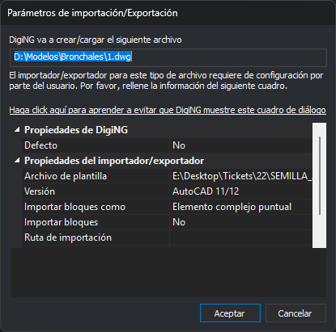

# Parámetros de importación/Exportación
<!-- id: parametros-de-importacion-exportacion -->

Digi3D.AI muestra este cuadro de diálogo al abrir, importar o exportar un archivo cuyo importador/exportador necesita parámetros, por ejemplo un archivo DWG. No lo muestra si el formato ya tiene parámetros por defecto (ver **Defecto**). Los parámetros de cada formato se describen en su página, dentro de [Importadores y exportadores](/digi3d-ai/referencia/ventana-de-dibujo/importadores-y-exportadores/README.md).

## Campos

* **Archivo**: la ruta del archivo que se va a crear o cargar. En algunas operaciones, como la orden [CARGA\_F](/digi3d-ai/referencia/ventana-de-dibujo/ordenes/c/carga-f.md) con el nombre del archivo como parámetro, muestra solo la extensión del archivo.
* **Enlace**: abre la página de la orden [PARAMETROS\_IMPORTACIÓN](/digi3d-ai/referencia/ventana-de-dibujo/ordenes/p/parametros-importacion.md), que fija los parámetros de un formato sin mostrar este cuadro de diálogo.
* **Propiedades de DigiNG**
  * **Defecto**: con **Sí**, Digi3D.AI usa estos parámetros para los siguientes archivos del mismo formato, sin mostrar el cuadro de diálogo, hasta que se cierra Digi3D.AI. Algunos formatos no admiten esta opción y vuelven a mostrar el cuadro de diálogo. Al iniciar Digi3D.AI vale **No**; después el cuadro de diálogo muestra el último valor elegido, hasta que se cierra Digi3D.AI.
* **Propiedades del importador/exportador**: los parámetros del formato del archivo.
* **Aceptar**: abre, importa o exporta el archivo con estos parámetros.
* **Cancelar**: cancela la operación. Excepción: en la orden CARGA\_F con el nombre del archivo como parámetro, el cuadro de diálogo se muestra otra vez con la ruta completa del archivo; **Cancelar** en ese segundo cuadro cancela la carga.
