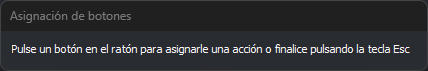
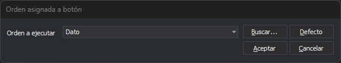

# Programar botones
<!-- id: programar-botones -->

Este cuadro de diálogo asigna una orden o una acción a cada botón de los ratones, joysticks y mandos conectados al equipo. Su título es **Asignación de botones**.

## Abrir el cuadro de diálogo

Selecciona la opción del menú **Herramientas/Programar botones...**. La opción solo aparece en el menú que muestra Digi3D.AI cuando no hay ninguna ventana de dibujo ni fotogramétrica abierta.

## Uso del cuadro de diálogo

1. Pulsa el botón del ratón, joystick o mando que quieres programar. Se abre el cuadro de diálogo **Orden asignada a botón**.
2. Elige la acción o la orden que ejecuta el botón y pulsa **Aceptar**.
3. Repite los pasos anteriores con cada botón que quieras programar.
4. Pulsa **Esc** para terminar.

La asignación se guarda para el usuario de _Windows_ y para el nombre del dispositivo. Dos dispositivos con el mismo nombre comparten la asignación.

Mientras el cuadro de diálogo espera que pulses un botón, el puntero del ratón está oculto. El cuadro de diálogo no tiene botón de cierre: se cierra con **Esc**.

### Números de los botones del ratón

Cada botón del ratón tiene un número:

| Botón | Número |
| :--- | :--- |
| Izquierdo | 1 |
| Central | 2 |
| Derecho | 4 |
| Cuarto botón | 8 |
| Quinto botón | 16 |

Las acciones también son números: **Dato** es 1, **Tentativo** es 2 y **Cancelar** es 4. Por eso, sin ninguna asignación, el botón izquierdo introduce un dato, el central un tentativo y el derecho cancela.

## Orden asignada a botón

Este cuadro de diálogo lo abren **Programar botones** y el botón **Configurar bot.** del cuadro de diálogo [Configuración de dispositivos de entrada](configuracion-de-dispositivos-de-entrada.md).

* **Orden a ejecutar**: la orden que ejecuta el botón, o una de estas acciones: **Dato**, **Tentativo**, **Cancelar**, **Combinar** y **Embrague**. Puedes escribir el nombre de cualquier orden. Si escribes un número distinto de 0, el botón actúa como el botón con ese número. Por ejemplo, con `4` el botón actúa como el botón derecho del ratón.
* **Buscar...**: abre el cuadro de diálogo [Buscar orden](buscar-orden.md), para elegir una orden por su nombre o su descripción. La orden elegida se escribe en **Orden a ejecutar**. La asignación no se guarda hasta pulsar **Aceptar**.
* **Defecto**: devuelve al botón su acción por defecto.
* **Aceptar**: guarda la asignación.
* **Cancelar**: cierra el cuadro de diálogo sin cambiar la asignación.
