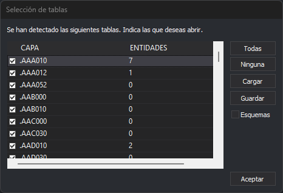

# Selección de tablas
<!-- id: seleccion-de-tablas -->

Digi3D.AI muestra este cuadro de diálogo al abrir un archivo o una base de datos con varias capas o tablas de geometrías, si está activada la opción de preguntar por las capas a cargar de ese formato. Por ejemplo, la opción [Preguntar por capas al cargar](configuracion/geopackage/preguntar-por-capas-al-cargar.md) de GeoPackage.

## Campos

* **Lista de capas**: las capas del archivo, con el nombre de la capa y su número de entidades. Marca las capas que quieres abrir. El nombre se muestra como *esquema.capa*; en los formatos sin esquemas, el esquema está vacío y el nombre empieza por un punto.
* **Todas** y **Ninguna**: marcan o desmarcan todas las capas.
* **Guardar**: guarda la lista de capas marcadas.
* **Cargar**: marca las capas guardadas con **Guardar** que existan en la lista y desmarca las demás. Así se repite la misma selección en otro archivo con las mismas capas.
* **Esquemas**: muestra un elemento por esquema, con el total de entidades de sus capas, en lugar de una línea por capa. Marcar un esquema abre todas sus capas.
* **Aceptar**: abre las capas marcadas.
