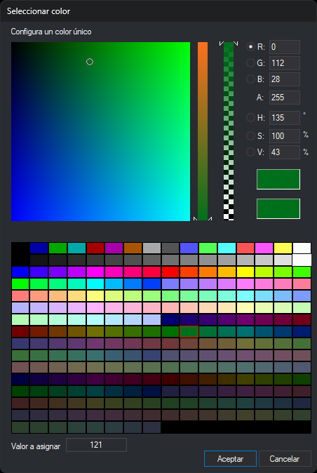
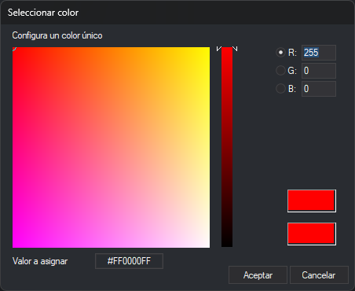

# Seleccionar color
<!-- id: seleccionar-color -->

Este cuadro de diálogo elige un color. Tiene dos versiones:

* **Con paleta**: lo abre el botón **...** de las propiedades de color de las representaciones de un código en la pestaña [Códigos](../editor-de-tablas-de-codigos/pestanas/codigos/README.md) del editor de tablas de códigos: **Color** (ventana de dibujo), **Color estéreo** (ventana fotogramétrica), **Color relleno** y **Color relleno recinto**. También lo abre la orden [COLOR_FONDO](../ventana-de-dibujo/variables/c/color-fondo.md) si hay una tabla de códigos cargada. Permite elegir un color de la paleta de la tabla de códigos o un color RGB con transparencia.
* **Sin paleta**: lo abren el resto de las propiedades de color, como las del cuadro de diálogo [Configuración](configuracion/README.md) o el color de fondo de un campo de base de datos, y las órdenes [COLOR_INDICE](../ventana-fotogrametrica/ordenes/c/color-indice.md) y [COLOR_DESCONOCIDO](../ventana-de-dibujo/ordenes/c/color-desconocido.md). Elige un color RGB.

## Campos

* **Configura un color único**: el cuadrado grande y la barra vertical de su derecha eligen el color. El botón de opción marcado indica qué componente controla la barra vertical; el cuadrado varía las otras dos.
* **R**, **G** y **B**: componentes rojo, verde y azul, de 0 a 255.
* **A**: opacidad, de 0 (transparente) a 255 (opaco). La segunda barra vertical también la cambia. No aparece cuando el valor que se edita no guarda opacidad, como el color de fondo de un campo o los colores de las órdenes.
* **H**, **S** y **V** (solo con paleta): tono en grados (0 a 359), saturación y brillo en porcentaje.
* **Muestras de color**: la superior muestra el color elegido; la inferior, el color inicial. Hacer clic en la inferior vuelve al color inicial.
* **Paleta** (solo con paleta): los 256 colores de la paleta de la tabla de códigos. Hacer clic en uno lo elige. La orden [COLOR_FONDO](../ventana-de-dibujo/variables/c/color-fondo.md) guarda el color RGB de esa entrada, no su número.
* **Valor a asignar**: el valor que recibe la propiedad. Es el número del color si se ha elegido un color de la paleta, o `#RRGGBBAA` (rojo, verde, azul y opacidad en hexadecimal) en cualquier otro caso.
* **Aceptar**: asigna el color. Si los valores escritos en **R**, **G**, **B** o **A** no coinciden con el color elegido, asigna los valores escritos, como `#RRGGBBAA`.
* **Cancelar**: cierra el cuadro de diálogo sin cambiar el color.
