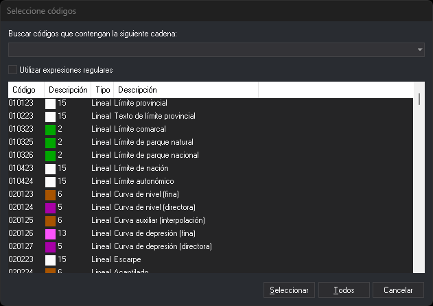

# Seleccione códigos
<!-- id: seleccione-codigos -->

Este cuadro de diálogo busca códigos en la tabla de códigos para que selecciones uno o varios. Lo abre el botón **Añadir...** del cuadro de diálogo [Selecciona códigos](selecciona-codigos.md), y lo abren directamente algunas órdenes, como [COD](../ventana-de-dibujo/ordenes/c/cod.md). La barra de título puede mostrar un texto propio de la orden que lo ha abierto.

## Campos

* **Buscar códigos que contengan la siguiente cadena**: texto que se busca. La lista muestra los códigos cuyo nombre o cuya descripción contienen ese texto, sin distinguir mayúsculas de minúsculas, y los códigos cuyo nombre encaja con el texto seguido de `*`. El desplegable ofrece las etiquetas de la tabla de códigos, precedidas de `#`: al elegir una, la lista muestra los códigos que tienen esa etiqueta.
* **Utilizar expresiones regulares**: el texto se interpreta como una expresión regular, que tiene que coincidir con el nombre completo o con la descripción completa del código, sin distinguir mayúsculas de minúsculas. Si la expresión regular no es válida, la búsqueda se detiene. Digi3D.AI recuerda el estado de esta casilla.
* **Lista de códigos**: resultado de la búsqueda, con el color, el tipo y la descripción de cada código.
* **Seleccionar**: entrega los códigos seleccionados en la lista. Si no hay ninguno seleccionado, entrega como código el texto escrito, que puede llevar comodines. Hacer doble clic en un código de la lista equivale a seleccionarlo y pulsar este botón.
* **Todos**: entrega todos los códigos de la lista.
* **Cancelar**: cierra el cuadro de diálogo sin entregar ningún código.

## Uso del cuadro de diálogo

1. Escribe en el campo de búsqueda una parte del nombre o de la descripción del código, o elige una etiqueta en el desplegable.
2. Selecciona en la lista los códigos que necesitas. Para seleccionar varios, mantén pulsada la tecla **Ctrl** o **Mayús** mientras haces clic.
3. Pulsa **Seleccionar**, o pulsa **Todos** para entregar todos los códigos de la lista.

## Observaciones

Si la orden que abre el cuadro de diálogo solo admite un código, la lista permite seleccionar un único código y el botón **Todos** está desactivado.
