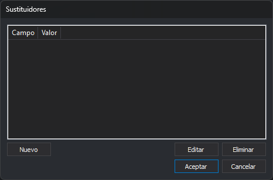
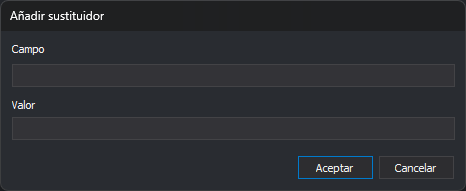

# Sustituidores
<!-- id: sustituidores -->

Este cuadro de diálogo edita una lista de pares de valores. Lo abre el botón **...** de dos propiedades, y los títulos de las dos columnas dependen de la propiedad que lo abre:

| Propiedad | Dónde está | Columnas | Qué hace cada par |
| :--- | :--- | :--- | :--- |
| Leer únicamente las geometrías que tengan los siguientes valores | Parámetros del motor de importación/exportación de [PostGIS](../ventana-de-dibujo/importadores-y-exportadores/postgis.md) | **Campo** y **Valor** | Solo se leen las geometrías cuyo campo tiene ese valor. Al guardar entidades, el campo toma ese valor. |
| Rutas a sustituir | Propiedades del sensor [ADS](../ventana-fotogrametrica/sensores/ads.md) | **Ruta a sustituir** y **Sustituir por** | En las rutas que lee el sensor, la primera ruta se sustituye por la segunda. |

## Campos

* **Lista**: un par por fila.
* **Nuevo**: abre el cuadro de diálogo **Añadir sustituidor**. Si la lista ya tiene una fila con el mismo valor en la primera columna (sin distinguir mayúsculas de minúsculas), el par no se añade y no se muestra ningún aviso.
* **Editar**: abre el cuadro de diálogo **Añadir sustituidor** con los valores de la fila seleccionada. Al editar no se comprueba si el valor de la primera columna se repite.
* **Eliminar**: elimina la fila seleccionada.
* **Aceptar**: guarda la lista en la propiedad.
* **Cancelar**: cierra el cuadro de diálogo sin cambiar la propiedad.

## Cuadro de diálogo Añadir sustituidor

Tiene dos cuadros de texto, uno por columna, con el título de la columna encima. **Aceptar** añade o modifica la fila; **Cancelar** la deja como estaba.

## Observaciones

La propiedad guarda los pares como una cadena de texto con los valores separados por punto y coma: `campo1;valor1;campo2;valor2;`.

En la propiedad **Rutas a sustituir** del sensor ADS, si el texto no contiene ningún punto y coma, el sensor sustituye esa ruta por la carpeta de trabajo del proyecto.
