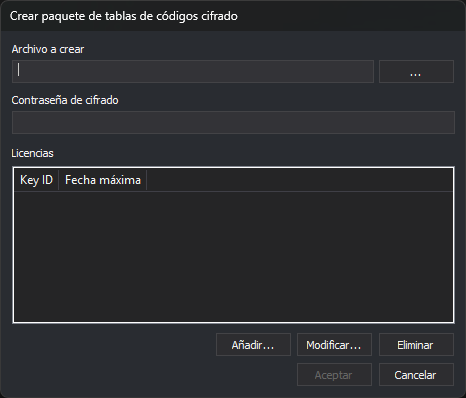

# Crear paquete de tablas de códigos cifrado
<!-- id: crear-paquete-cifrado -->

Esta opción del menú **Archivo** crea un paquete `.dt` con la tabla de códigos cifrada. Digi3D.AI solo carga el paquete en un equipo con una de las llaves de protección de la lista de licencias, y hasta la fecha máxima de esa licencia. Si la llave no está en la lista o la fecha del equipo es posterior, Digi3D.AI muestra un error y no carga la tabla.

## Controles

* **Archivo a crear**: ruta del paquete. El botón **...** abre el cuadro **Guardar como** con el filtro **Paquete de tabla de códigos (\*.dt)**.
* **Contraseña de cifrado**: contraseña con la que se cifra la tabla.
* **Licencias**: lista de licencias, con las columnas **Key ID** y **Fecha máxima**.
* **Añadir...**: abre el cuadro **Añadir licencia**, que pide el **KeyID de la llave de protección** y una fecha en el calendario. **Aceptar** se habilita al escribir el KeyID. Si el KeyID ya está en la lista, se sustituye su fecha.
* **Modificar...**: abre el mismo cuadro con los datos de la licencia seleccionada. Al aceptarlo, la licencia sustituye a la seleccionada.
* **Eliminar**: elimina la licencia seleccionada.

**Aceptar** se habilita cuando hay archivo, contraseña y al menos una licencia. Al pulsarlo se escribe el paquete. Si no se puede escribir, el editor muestra un mensaje de error.

Crear el paquete no guarda la tabla de códigos abierta: si tiene cambios, el editor sigue preguntando si guardarlos al cerrar.
