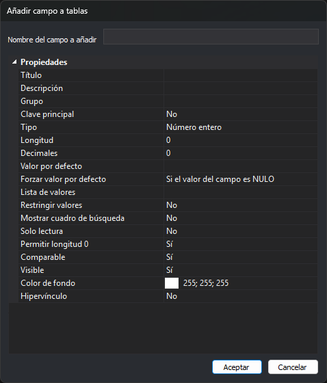

# Añadir campo a tablas
<!-- id: anadir-campo-a-tablas -->

Este cuadro de diálogo aparece con la opción **Base de datos/Campos/Añadir un campo a todas las tablas...**. Añade el mismo campo a todas las tablas que no tienen un campo con ese nombre.

## Controles

* **Nombre del campo a añadir**: nombre del campo. Si una tabla ya tiene un campo con ese nombre, sin distinguir mayúsculas de minúsculas, esa tabla no cambia.
* **Propiedades**: propiedades del campo nuevo. Son las mismas que las de la pestaña Base de datos, descritas en [Propiedades de los campos](../../pestanas/base-de-datos/propiedades-de-los-campos.md), salvo **Copiable**, que el cuadro no ofrece.
* **Aceptar**: añade el campo. No cierra el cuadro si el nombre está vacío.
* **Cancelar**: cierra el cuadro sin cambiar nada.

El campo se añade al final de cada tabla. Si alguna tabla cambia, la tabla seleccionada en la pestaña **Base de datos** se vuelve a cargar.
