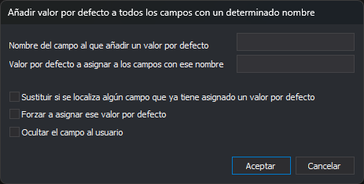

# Añadir valor por defecto a todos los campos con un determinado nombre
<!-- id: asignar-valor-defecto-campos -->

Este cuadro de diálogo aparece con la opción **Base de datos/Campos/Asignar un valor por defecto a todos los campos con un determinado nombre...**. Asigna el mismo valor por defecto a los campos que tienen un nombre dado en todas las tablas.

## Controles

* **Nombre del campo al que añadir un valor por defecto**: nombre del campo. No distingue mayúsculas de minúsculas.
* **Valor por defecto a asignar a los campos con ese nombre**: valor que se asigna a la propiedad **Valor por defecto** de esos campos.
* **Sustituir si se localiza algún campo que ya tiene asignado un valor por defecto**: si no se marca, los campos que ya tienen un valor por defecto no cambian.
* **Forzar a asignar ese valor por defecto**: si se marca, la propiedad **Forzar valor por defecto** de los campos pasa a **Siempre**; si no, a **Si el valor del campo es NULO**.
* **Ocultar el campo al usuario**: pone a **No** la propiedad **Visible** de los campos. Si no se marca, la pone a **Sí**.

**Aceptar** modifica los campos de todas las tablas que cumplen las condiciones. **Cancelar** cierra el cuadro sin cambiar nada.

Consulta las propiedades en [Propiedades de los campos](../../pestanas/base-de-datos/propiedades-de-los-campos.md).
