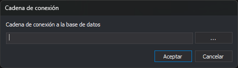

# Cadena de conexión
<!-- id: cadena-de-conexion -->

Este cuadro de diálogo aparece con las opciones **Base de datos/Tablas/Importar esquema de una base de datos en formato Geographics...** e **Importar esquema de una base de datos en formato CATDBS...**. Pide la cadena de conexión OLE DB de la base de datos cuyo esquema se importa.

## Controles

* **Cadena de conexión a la base de datos**: cadena de conexión OLE DB.
* **...**: abre el asistente de vínculos de datos de Windows. Al terminarlo, la cadena que genera sustituye el contenido del campo.
* **Aceptar**: conecta con la base de datos e importa el esquema.
* **Cancelar**: cierra el cuadro sin importar.

## Resultado

Al aceptar, el editor lee las tablas de la base de datos y crea una tabla por cada una, con sus campos. El campo de clave principal de cada tabla queda marcado como clave principal y oculto. La descripción de cada campo se lee de la base de datos.

Las tablas importadas sustituyen a todas las tablas de la tabla de códigos. Si no se puede abrir alguna tabla, un cuadro de tareas permite reintentarlo, omitir esa tabla o cancelar la importación.

Si la conexión falla, el editor muestra el error y no cambia las tablas.
