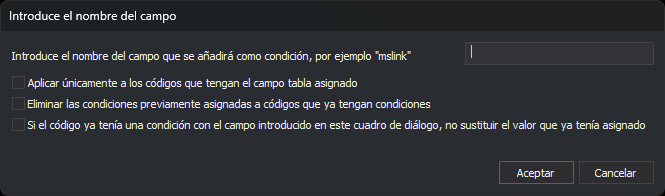

# Introduce el nombre del campo
<!-- id: condicion-campo-igual-codigo -->

Este cuadro de diálogo aparece con la opción **Base de datos/Códigos/Añadir automáticamente una condición a las tablas de cada código del tipo [campo]=[nombre del código]**. Añade a cada código una condición `campo=código` en su propiedad [Condiciones](../../pestanas/codigos/base-de-datos.md#condiciones).

Por ejemplo, con el campo `mslink`, el código `010101` recibe la condición `mslink=010101`.

## Controles

* **Introduce el nombre del campo que se añadirá como condición, por ejemplo "mslink"**: nombre del campo.
* **Aplicar únicamente a los códigos que tengan el campo tabla asignado**: si se marca, los códigos sin tabla no cambian.
* **Eliminar las condiciones previamente asignadas a códigos que ya tengan condiciones**: si se marca, se borran las condiciones que tenía cada código antes de añadir la nueva.
* **Si el código ya tenía una condición con el campo introducido en este cuadro de diálogo, no sustituir el valor que ya tenía asignado**: si se marca, un código que ya tiene una condición con ese campo la conserva. Si no se marca, su valor pasa a ser el nombre del código.
* **Aceptar**: modifica los códigos y recarga la pestaña Códigos.
* **Cancelar**: cierra el cuadro sin cambiar nada.
