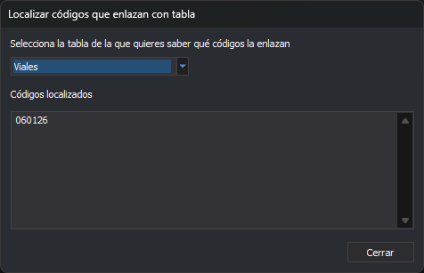

# Localizar códigos que enlazan con tabla
<!-- id: localizar-codigos-enlazan-tabla -->

Este cuadro de diálogo aparece con la opción **Base de datos/Códigos/Localizar todos los códigos que enlazan con una determinada tabla...**. Lista los códigos cuya propiedad **Tabla** es una tabla dada.

## Controles

* **Selecciona la tabla de la que quieres saber qué códigos la enlazan**: desplegable con las tablas de la tabla de códigos, en orden alfabético. Al elegir una, la lista se actualiza.
* **Códigos localizados**: un código por línea. La comparación del nombre de la tabla no distingue mayúsculas de minúsculas.
* **Cerrar**: cierra el cuadro. No cambia nada en la tabla de códigos.
