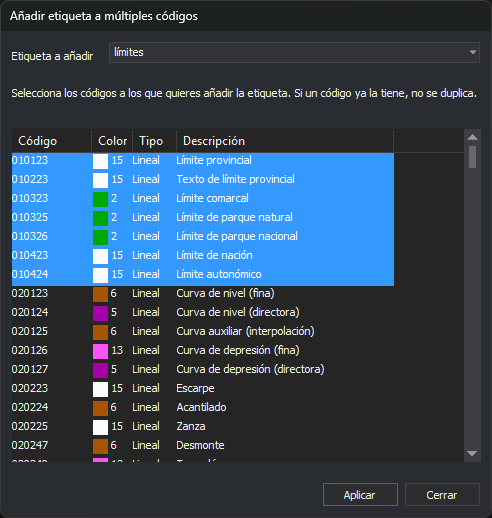

# Añadir etiqueta a múltiples códigos
<!-- id: anadir-etiqueta-a-multiples-codigos -->

Este cuadro de diálogo aparece con la opción **Códigos/Añadir etiqueta a múltiples códigos...**. Añade una [etiqueta](../../pestanas/codigos/propiedades-del-codigo.md#etiquetas) a varios códigos a la vez.

## Controles

* **Etiqueta a añadir**: escribe una etiqueta nueva o elige una de las que ya usa la tabla de códigos.
* **Lista de códigos**: códigos de la tabla, con las columnas **Código**, **Color**, **Tipo** y **Descripción**. Selecciona los códigos a los que quieres añadir la etiqueta; admite selección múltiple. Si un código ya la tiene, no se duplica.
* **Aplicar**: añade la etiqueta a los códigos seleccionados y vacía el campo **Etiqueta a añadir**. El cuadro sigue abierto para añadir otra etiqueta.
* **Cerrar**: cierra el cuadro.

El cuadro se puede redimensionar y recuerda su tamaño y posición.
