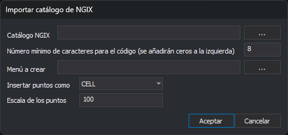

# Importar catálogo de NGIX
<!-- id: importar-catalogo-ngix -->

Este cuadro de diálogo aparece con la opción **Códigos/Importar códigos de archivo de catálogo de NGIX...**. Crea códigos a partir de la sección `features` de un catálogo de NGIX (`.cat`) y escribe un menú del [Cuadro de herramientas](/digi3d-ai/referencia/paneles/cuadro-de-herramientas.md) con esos códigos.

## Controles

* **Catálogo NGIX**: archivo `.cat`. El botón **...** abre el cuadro **Abrir**.
* **Número mínimo de caracteres para el código (se añadirán ceros a la izquierda)**: ancho mínimo del nombre de cada código. Por defecto, 8: el código `1203` se crea como `00001203`.
* **Menú a crear**: archivo `.menu.xml` que se escribe. El botón **...** abre el cuadro **Guardar como**.
* **Insertar puntos como**: tipo de elemento DGN con el que se exportarán los códigos que tienen célula: **CELL** o **SHARED_CELL**.
* **Escala de los puntos**: escala de las células en los parámetros de traducción a DGN. Por defecto, 100.
* **Aceptar**: importa el catálogo.
* **Cancelar**: cierra el cuadro sin importar.

## Resultado

Por cada código del catálogo, el editor:

* crea el código con la descripción, el color y el tipo del catálogo; si el código tiene célula, crea también un estilo `Estilo_<célula>` que la usa como símbolo;
* rellena sus parámetros de traducción a DGN con el nivel, el color, el estilo de línea, el grosor y la célula del catálogo;
* añade al menú un grupo por sección del catálogo, con una opción por código que ejecuta `cod=<código>`.

Mensajes:

* **No se ha localizado la sección features**: el catálogo no tiene la sección `features`.
* **Error al crear el archivo de menú**: no se puede escribir el archivo `.menu.xml`.
* **Fin del fichero inesperado**: el catálogo termina antes de cerrar sus secciones.
* **Archivo importado satisfactoriamente**: la importación ha terminado.
