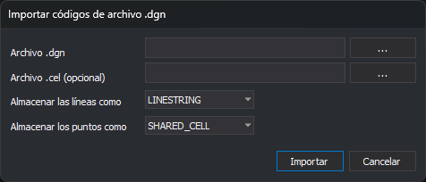

# Importar códigos de archivo .dgn
<!-- id: importar-codigos-dgn -->

Este cuadro de diálogo aparece con la opción **Códigos/Importar códigos de archivo .dgn...**. Crea códigos a partir de los niveles de un archivo DGN de MicroStation y, opcionalmente, de las células de una biblioteca `.cel`.

## Controles

* **Archivo .dgn**: archivo DGN cuyos niveles se importan. El botón **...** abre el cuadro **Abrir**.
* **Archivo .cel (opcional)**: biblioteca de células. El botón **...** abre el cuadro **Abrir**.
* **Almacenar las líneas como**: tipo de elemento DGN con el que se exportarán las líneas de los códigos creados: **LINE**, **LINESTRING** o **SHAPE**.
* **Almacenar los puntos como**: tipo de elemento DGN con el que se exportarán los puntos de los códigos creados a partir de células: **POINT**, **CELL** o **SHARED_CELL**.
* **Importar**: crea los códigos.
* **Cancelar**: cierra el cuadro sin importar.

## Resultado

* Si se indica un archivo `.cel`, se crea primero un código puntual por cada célula, con el nombre de la célula y un estilo que la usa como símbolo.
* Después se crea un código lineal por cada nivel del archivo DGN que no exista ya en la tabla de códigos. El código toma el nombre y la descripción del nivel y su color, grosor y estilo de línea.

Los estilos nuevos se añaden a la pestaña **Estilos** y los códigos nuevos al final de la pestaña **Códigos**.

La importación la hace la extensión de archivos DGN. Si ninguna extensión cargada la ofrece, el editor muestra el mensaje **No se ha encontrado ninguna extensión capaz de importar códigos de un archivo DGN de MicroStation.** Si el archivo no se puede leer, muestra el error.
